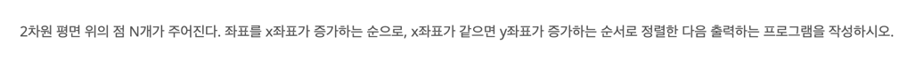
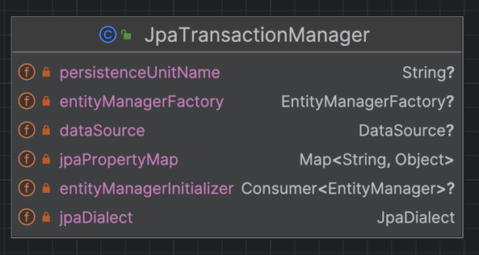

# 전략 패턴이란 무엇인가?
> 전략 패턴(strategy pattern) 또는 정책 패턴(policy pattern)은 실행 중에 알고리즘을 선택할 수 있게 하는 행위 소프트웨어 디자인 패턴이다.  
> -위키백과-

# 왜 알고리즘을 바꿔야 할까?
> 디자인 패턴을 적용하면 파일과 라인의 개수가 늘어나는데 굳이 전략패턴을 공부해서 써야 하는 이유가 있을까?..

# 오리 시뮬레이션 게임 - 전략 패턴 없이
```java
public abstract class Duck {
    public abstract void quack();
    public abstract void swim();
    public abstract void display();
}

public class MallardDuck extends Duck {
    @Override
    public void quack() {}
    
    @Override
    public void swim() {}

    @Override
    public void display() {}
}

public class RedheadDuck extends Duck {
    // 위와 동일
}
```
- 이 설계의 문제점은 무엇인가?
- 오리가 날아야 한다는 기능을 추가한다면? -> `Duck`클래스에 fly 메소드를 추가?

## 문제 상황
- Duck 클래스에 fly 메소드를 추가했음
- 날아다니면 안되는 오리들도 날아다님
- 코드를 재사용하려고 했지만, 좋지 않아 보이는 설계가 되어 버림
- 못 날게 하려면 빈 메소드로 오버라이드를 해야함

# 인터페이스를 활용한 개선
```java
interface Flyable {
    void fly();
}

interface Quackable {
    void quack();
}

public abstract class Duck {
    public abstract void swim();
    public abstract void display();
}
```
- 필요한 클래스만 인터페이스를 구현
- 재사용이 필요한 코드는 추상 클래스를 활용한다.
- 코드 중복이 매우 심해짐 -> 날아가는 동작을 바꾸기 위해 Duck의 서브 클래스를 수정 해야 함
- 자바 8이상이라면.. default 메소드로 중복을 개선 가능 -> 근데 만약 사용할 수 없다면?

# 행동을 클래스화 시킨다.

```java
interface Flyable {
    void fly();
}

public class FlyWithWings implements Flyable {
    @Override
    public void fly() {
        // 날아다닌다~
    }
}

public class FlyNoWay implements Flyable {
    @Override
    public void fly() {
        // 못 날아다닌다.
    }
}

interface Quackable {
    void quack();
}

public class Quack implements Quackable {
    @Override
    public void quack() {
        // 퀔퀔
    }
}

public class Squack implements Quackable {
    @Override
    public void quack() {
        // 스퀔스퀔
    }
}

public class MuteQuack implements Quackable {
    @Override
    public void quack() {
        // ...
    }
}
```

# 연습 문제 풀이
```java
interface WeaponBehavior {
    void useWeapon();
}

class KnifeBehavior implements WeaponBehavior {
    @Override
    void useWeapon() {
        // 칼!
    }
}

class BowAndArrowBehavior implements WeaponBehavior {
    @Override
    void useWeapon() {
        // 도끼랑 활
    }
}

class AxeBehavior implements WeaponBehavior {
    @Override
    void useWeapon() {
        // 도끼
    }
}

class SwoardBehavior implements WeaponBehavior {
    @Override
    void useWeapon() {
        // 도끼
    }
}

public abstract class Character {
    private WeaponBehavior weapon;
    
    public void fight() {
        weapon.useWeapon();
    }
    
    public void setWeapon(WeaponBehavior w) {
        this.weapon = w;
    }
}

class Queen extends Character {}
class King extends Character {}
class Troll extends Character {}
class Knight extends Character {}
```

# 재미로 보는 전략 패턴

## 나도 모르게 쓰는 전략 패턴 - Java 편


```java
import java.util.ArrayList;
import java.util.Collections;
import java.util.List;

class Position {

    private final int x;
    private final int y;

    Position(int x, int y) {
        this.x = x;
        this.y = y;
    }

    public int getX() {
        return x;
    }

    public int getY() {
        return y;
    }
}

public class Main {
    public static void main(String[] args) {
        List<Position> position = makeRandomPositionList();
        // 정렬 기준을 런타임에 갈아낄 수 있다.
        Collections.sort(position, ((o1, o2) -> {
            // TODO o1, o2 null 방어코드
            if (o1.getX() == o2.getX()) return Integer.compare(o1.getY(), o2.getY());
            return Integer.compare(o1.getX(), o2.getX());
        }));
    }

    public static List<Position> makeRandomPositionList() {
        return List.of();
    }
}

/**
 * Collections.sort의 내부 구현
 * 매개변수 c를 통해서 정렬 알고리즘을 추상화 한 것을 볼 수 있음.
 */
public static <T> void sort(List<T> list, Comparator<? super T> c) {
    list.sort(c);
}

default void sort(Comparator<? super E> c) {
    Object[] a = this.toArray();
    Arrays.sort(a, (Comparator) c);
    ListIterator<E> i = this.listIterator();
    for (Object e : a) {
        i.next();
        i.set((E) e);
    }
}
```

- 자바에서는 정렬 비교 기준을 `Comparable`과 `Comparator`로 추상화하여 다양한 곳에 사용하도록 지원
- `Comparable`은 자연 정렬되도록 클래스에서 구현하게 하기 위하여 설계된 인터페이스
- `Comparator`는 필요할 때 `동적`으로 정렬 기준을 번경하기 위해 설계된 인터페이스

## 나도 모르게 사용하는 전략 패턴 - Spring!

```java

public void setDataSource(@Nullable DataSource dataSource) {
    if (dataSource instanceof TransactionAwareDataSourceProxy) {
        this.dataSource = ((TransactionAwareDataSourceProxy) dataSource).getTargetDataSource();
    } else {
        this.dataSource = dataSource;
    }
}

public void setJpaProperties(@Nullable Properties jpaProperties) {
    CollectionUtils.mergePropertiesIntoMap(jpaProperties, this.jpaPropertyMap);
}
        
public void setJpaPropertyMap(@Nullable Map<String, ?> jpaProperties) {
        if (jpaProperties != null) {
        this.jpaPropertyMap.putAll(jpaProperties);
    }
}

@Override
protected Object doGetTransaction() {
    JpaTransactionObject txObject = new JpaTransactionObject(); 
    txObject.setSavepointAllowed(isNestedTransactionAllowed());

        EntityManagerHolder emHolder = (EntityManagerHolder)
            TransactionSynchronizationManager
            .getResource(obtainEntityManagerFactory());
    // 생략
    txObject.setEntityManagerHolder(emHolder, false);
        

    if (getDataSource() != null) {
        ConnectionHolder conHolder = (ConnectionHolder)
        TransactionSynchronizationManager.getResource(getDataSource()); 
        txObject.setConnectionHolder(conHolder);
    }

    return txObject;
}

```
- Spring의 JPA `JpaTransactionManager`에서 발췌한 코드
- `setter`를 부분적으로 열어두어 필드들을 동적으로 교체할 수 있도록 설계한 것으로 파악하는 중