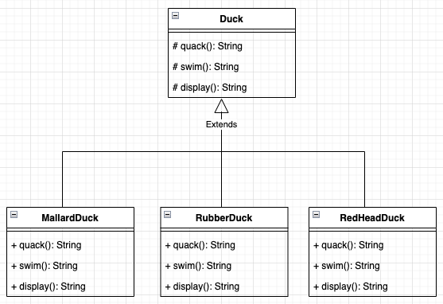
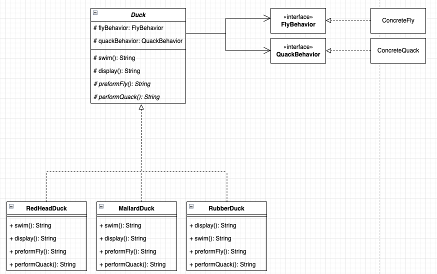

# 1. 디자인 패턴 소개와 전략 패턴

### 상속을 통해 구현한 오리 시뮬레이션 게임

  
위와 같은 구조에서 `MallardDuck` 과 `RedHeadDuck`이 나는 기능을 필요로 할 경우엔 Duck 클래스에 추가하는 것이 효율적이다.  
하위 클래스에 `fly()` 메소드를 추가하게되면 나는 기능이 필요한 오리가 생길 때마다 중복되는 코드를 작성하게 된다. 그러나 상속에도 문제점이 있다.  
`RubberDuck`은 나는 기능을 필요로하지 않기 때문이다. 만약 `RubberDuck`을 호출하는 클라이언트에서 실수로 fly() 메소드를 호출한다면 서비스 에러가 발생하는 것과 같다. 

### 상속을 통한 재사용
- 하위 클래스에서 상위 클래스의 메소드를 필요로 하지 않을 경우 원치않은 결과를 얻을 수 있음
- 실행시점에 동적으로 행위를 변경하기 어려운 문제가 있음 
- 상위 클래스의 변경이 하위 클래스에게 영향을 줄 수 있는 구조
- 단순히 상속만 활용할 경우 요구사항 변경에 유연하게 대응하기 어려운 문제

### 문제를 명확하게 파악하기
- 서브클래스 마다 클래스의 행위가 바뀔 수 있는데도 모든 서브클래스에서 한 가지 행동만 사용하도록 하는 것은 올바르지 못하다.
- 인터페이스로 행위를 추상화하여 구현하는 방법도 있지만, 이는 중복될 수 있는 코드를 재사용할 수 없다는 점에서 문제가 된다.
- 클래스에서 달라지는 부분을 찾아내고 달라지지 않는 부분과 분리한다. ***디자인 원칙 중 첫 번째 원칙**


### 전략패턴을 통해 구조 변경
  
위 구조는 변하지 않는 `swim`과 `display` 메소드를 상위 클래스에서 구현하고 하위 클래스가 재사용하는 구조이다. 변경된 구조는 이번 챕터에서 소개한 디자인 원칙을 위반하지 않는다.    
변경되는 `fly`와 `quack` 메소드는 인터페이스에게 위임하고 Duck Class가 이를 구성한다. 때문에 하위 클래스를 생성하려면`FlyBehavior`와 `QuackBehavior` 구현체를 주입하여야 한다.  
이 구조는 오리의 `fly`와 `quack`이 변경될 때 해당 클래스를 수정하지 않고 새로운 구현체를 주입하여 유연하게 변경할 수 있다. 추가적으로 구현체를 변경하는 메소드를 생성하여 런타임시에 동적으로 행위를 변경할 수 있다.


#### *디자인 원칙
- 변화하는 부분과 변하지 않는 부분을 분리한다.
- 구현보다는 인터페이스에 맞춰서 프로그래밍 한다.
- 상속보단 구성을 활용한다.


### 전략패턴
```text
전략패턴은 알고리즘을 저의하고 캡슐화하여 상황에 맞게 절절한 알고리즘으로 변경하여 사용할 수 있다.  
전략패턴을 활용하면 클라이언트로부터 알고리즘을 분리해서 독립적으로 변경할 수 있다.
``` 

