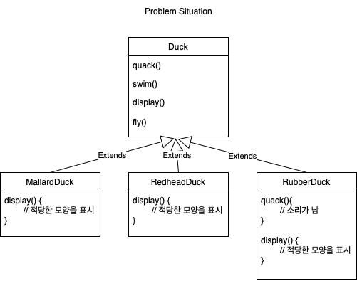
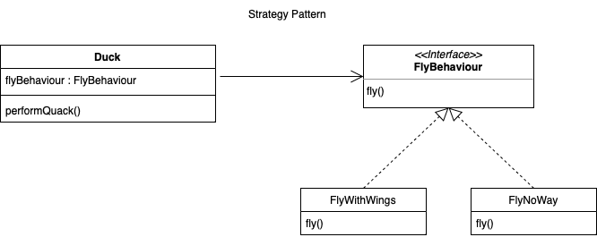

---

marp : true

---

# 전략 패턴(Strategy Pattern)

---

## 요약

* 전략 패턴은 알고리즘군을 정의하고 캡슐화해서 각각의 알고리즘군을 수정해서 쓸 수 있게 해 줍니다.
* 전략 패턴은 클라이언트의 알고리즘 사용과 구현을 분리하는 데 중점을 두고 있습니다.

---

## 문제 상황

Duck 클래스에서 fly 메서드를 추가하므로써 Duck의 하위 클래스에서 fly 메서드를 사용할 수 있게 되었습니다. 하지만 일부 하위 클래스에서는 fly 메서드를 사용하지 않아야하는 상황이 발생합니다.

---

## 전략 패턴을 통한 해결

위 문제의 상황에서 Duck의 fly는 하위 클래스에 따라서 변하는 부분입니다. 또한 디자인 원칙 1번에 따라 변하는 부분을 분리하고, 변하지 않는 부분과 분리해야합니다.

따라서 문제를 해결하기 위해서는 전략 패턴을 통해 변하는 부분을 인터페이스를 통해 분리한다음, 구현체를 통해 구현하고, 클라이언트에서는 인터페이스를 통해 구현체를 사용하도록 합니다.

---

## 상속의 문제점

* 상속은 캡슐화를 깨뜨려 유연성이 떨어집니다.
* 상위 클래스의 구현에 따라서 하위 클래스의 동작에 이상이 생길 수 있습니다.
* 상속을 통해 구현된 코드는 컴파일 시점에 결정되기 때문에 동적으로 행위를 변경할 수 없습니다.

---

## 전략 패턴 사용의 이점

* 캡슐화를 통한 코드 재사용성 할 수 있습니다.
* 동적으로 행위를 변경할 수 있습니다.
* 클라이언트의 알고리즘 사용과 구현을 분리할 수 있습니다.

---

## 더 알아보기

* 디자인 원칙
* 이팩티브 자바

---

### 디자인 원칙

* 애플리케이션에서 달라지는 부분을 찾아내고, 달라지지 않는 부분과 분리한다.
* 구현보다는 인터페이스에 맞춰서 프로그래밍한다.
* 상속보다는 구성(컴포지션)을 활용한다.

---

### 이펙티브 자바
> 아이템 18 상속보다는 컴포지션을 사용하라
> * 메서드 호출과 달리 상속은 캡슐화를 깨뜨린다. 상위 클래스의 구현에 따라서 하위 클래스의 동작에 이상이 생길 수 있다.
> * 상속의 취약점을 피하려면 상속 대신 컴포지션과 전달을 사용하자.

> 아이템 20 추상 클래스보다는 인터페이스를 우선하라