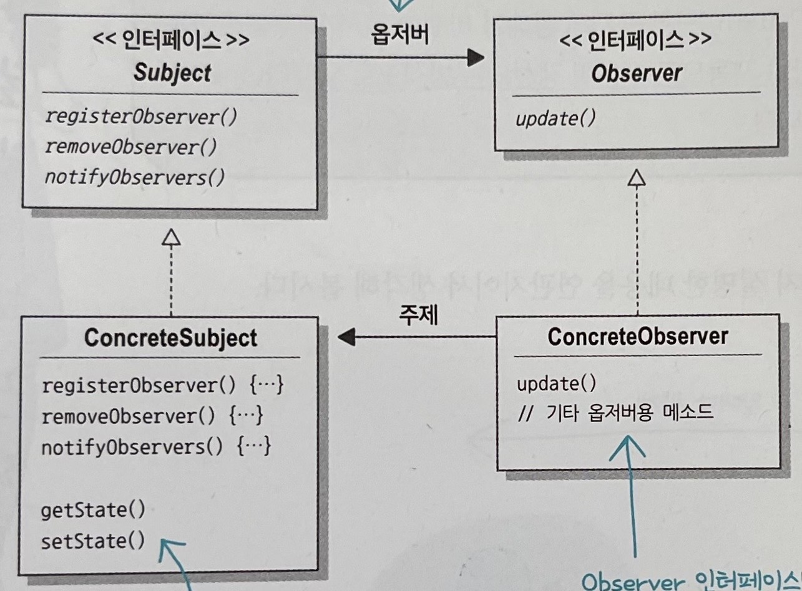
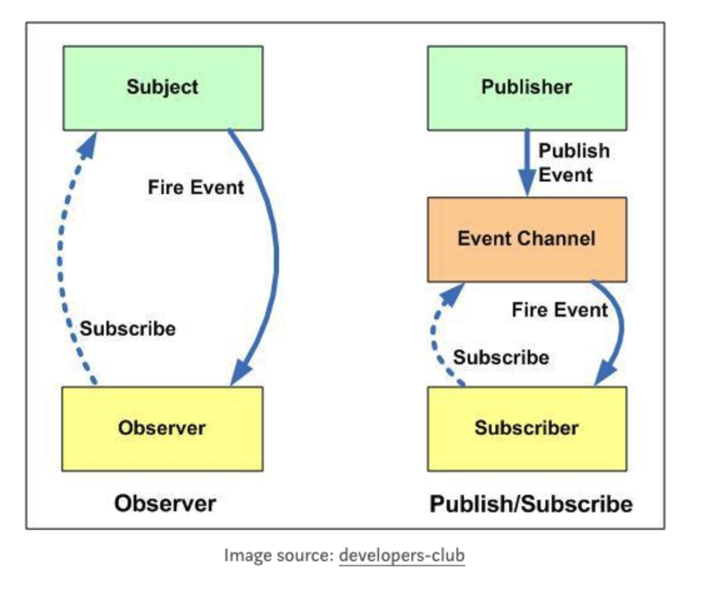

# 2장 :  옵저버 패턴

## 1. 옵저버 패턴이란?

옵저버 패턴은 한 객체의 상태가 바뀌면 그 객체에 의존하는 다른 객체에게 연락이 가고 자동으로 내용이 갱신되는 방식으로 일대다 의존성을 정의합니다.

## 2. 옵저버 패턴의 구성

옵저버 패턴은 주제와 옵저버로 구성이 되어있습니다.

* 주제(Subject) : 주제는 옵저버의 목록을 관리하며 주제 상태 변화를 알리기 위한 메서드를 제공하는 인터페이스입니다.
* 옵저버(Observer) : 옵저버는 주제의 상태 변화에 대해서 알림을 받는 인터페이스입니다.

## 3. 옵저버 패턴의 느슨한 결합(Loose Coupling)

옵저버 패턴에서는 주제와 옵저버 모두 인터페이스로 구성되어 서로에 대해 잘 모르는 관계를 유지합니다. 이를 통해 두 객체 사이의 느슨한 결합을 유지할 수 있습니다.

옵저버 패턴에서 느슨한 결합을 유지함에 있어서 장점은 다음과 같습니다.
1. 객체들간의 상호 작용을 유연하게 만들어 줍니다.
2. 주제 객체는 옵저버들의 구체적인 클래스를 알지 않고도 상태 변화를 알릴 수 있습니다.
3. 새로운 옵저버를 추가하거나 제거하기가 쉽습니다.
4. 주제와 옵저버는 서로 독립적으로 재사용할 수 있습니다.
5. 주제나 옵저버가 바뀌더라도 서로한테 영향을 미치지 않습니다.

## 4. 주제 내부의 필드 값으로 인터페이스를 이용하기

책에서의 주제의 구현체는 내부에 상태를 정의하고 사용합니다. 하지만 주제의 abstract class를 만들고 내부 필드 또한 인터페이스로 사용한다면 좀 더 유연하게 사용할 수 있습니다.

## 5. 스프링에서의 유사 옵저버 패턴

* 스프링 이벤트 : 스프링에서는 ApplicationEventPublisher와 ApplicationListener 인터페이스를 통해 옵저버 패턴을 구현합니다. 스프링 4.2 이후로는 @EventListener 어노테이션을 통해 더욱 간편하게 이벤트를 처리할 수 있습니다.

## 출판 구독 패턴이란 무엇인가?

출판 구독 패턴은 옵저버 패턴과 유사한 구조를 가지고 있습니다. 하지만 더 나아가 출판 구독 패턴은 주제와 옵저버 사이에 중간 역할을 하는 제 3자를 두어 주제와 옵저간의 결합도를 낮추는 패턴입니다.

