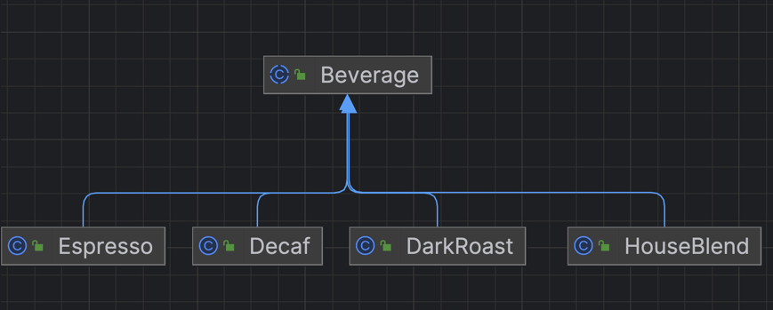
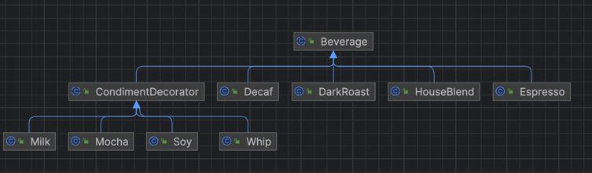

## 데코레이터 패턴

### 스타버즈 초기 클래스 다이어그램
  

- 초기 스타버즈 시스템은 `Beverage`라는 추상 클래스를 상속 받아서 중복을 제거하는 형태로 구성
- 새로운 음료가 추가될 때마다 `Beverage`를 상속 받는 형태 -> 클래스 매우 많아짐

### 첫 번째 개선 노력 - 첨가물을 상위 클래스에 몰아 넣자.

```java
public abstract class Beverage {

    protected String description;
    protected boolean milk  = false;
    protected boolean soy   = false;
    protected boolean mocha = false;
    protected boolean whip  = false;
    
    private static final int MILK_FEE  = 1000;
    private static final int SOY_FEE   = 2000;
    private static final int MOCHA_FEE = 3000;
    private static final int WHIP_FEE  = 4000;
    
    public int cost() {
        int fee = 0;
        
        if (milk) {
            fee += MILK_FEE;
            System.out.println("MILK 가격 추가");
        }

        if (soy) {
            fee += SOY_FEE;
            System.out.println("SOY 가격 추가");
        }

        if (mocha) {
            fee += MOCHA_FEE;
            System.out.println("MOCHA 가격 추가");
        }

        if (whip) {
            fee += WHIP_FEE;
            System.out.println("WHIP 가격 추가");
        }
        
        return fee;
    }

    public String getDescription() {
        return description;
    }
}

public class DarkRoast extends Beverage{

    public DarkRoast() {
        this.description = "DarkRoast";
    }

    @Override
    public int cost() {
        int cost = super.cost();
        return cost + 1000;
    }
}
```

- 현재 구조는 첨가물 가격이 바뀌면 기존 코드를 변경해야 함
- 첨가물의 종류가 많아지면 새로운 메소드를 추가해야 함, 슈퍼 클래스의 cost도 변경 해야 함
- 첨가물이 안 들어가야 하는 음료는 어떻게 함?
- 음료의 하위 클래스에 유연성이 굉장히 떨어지는 구조
- 이를 해결하기 위해서 `구성`을 이용하기로 함

# 데코레이터 패턴 구성하기

- 위 클래스 다이어 그램을 보면 최상위 계층에 클래스가 존재함.
- 기본 개체를 위한 클래스와, 그 클래스에 추가하기 위한 데코레이터가 존재

  

```java
public abstract class Beverage {

    protected String description;

    public abstract int cost();
    public String getDescription() {
        return description;
    }
}

public abstract class CondimentDecorator extends Beverage {
    protected Beverage beverage;

    public abstract String getDescription();
}
```
- Beverage는 음료 자체를 나타내기 위한 클래스
- CondimentDecorator는 첨가물을 나타내기 위한 클래스임
- CondimentDecorator에서 Beverage를 포함하여 활용하는 형태.

```java
public class StarbuzzCoffee {

    @Test
    void espresso() {
        Beverage beverage = new Espresso();
        System.out.printf("%s $%d%n",beverage.getDescription(), beverage.cost());
    }

    @Test
    void espresso_with_mocha() {
        Beverage beverage = new Mocha(new Espresso());
        System.out.printf("%s $%d%n",beverage.getDescription(), beverage.cost());
    }

    @Test
    void espresso_with_mocha_and_soy() {
        Beverage beverage = new Soy(new Mocha(new Espresso()));
        System.out.printf("%s $%d%n",beverage.getDescription(), beverage.cost());
    }
}
```

```bash
Espresso $2000
Espresso, Mocha $5000
Espresso, Mocha, Mocha $8000
```

- 런타임에 데코레이터를 추가하여 더 유연한 클래스 설계를 얻을 수 있었음.
- 자잘한 클래스가 엄청나게 많이 추가 되는 단점 -> 팩토리와 빌더를 이용해서 해결 가능