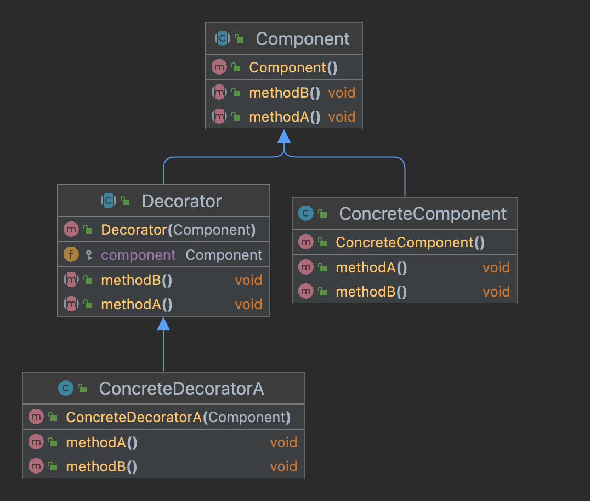

# 3장 : 데코레이터 패턴

## Decorator Pattern이란?

Decorator Pattern으로 객체에 추가 요소를 동적으로 더할 수 있습니다. 데코레이터를 사용하면 서브클래스를 만들 때보다 훨씬 유연하게 기능을 확장할 수 있습니다.

## Decorator Pattern의 구성요소

* Component : 기본 기능을 뜻하는 ConcreteComponent와 추가 기능을 뜻하는 Decorator의 공통 기능을 정의합니다.
* ConcreteComponent : 기본 기능을 구현하는 클래스입니다. 데코레이터를 적용할 대상이 됩니다.
* Decorator : Component와 동일한 인터페이스를 구현합니다. ConcreteDecorator를 감싸 추가적인 기능을 제공합니다. 즉, 내부적으로 Componet를 필드로 가지며 생성자를 통해 Component를 받아와 추가적인 기능을 제공합니다.
* ConcreteDecorator : Decorator를 구현한 실제 객체입니다. 또한 Decorator를 확장하여 추가적인 기능을 제공합니다. 여러 개의 ConcreteDecorator를 조합하여 다양한 기능을 확장할 수 있습니다.

## Decorator Pattern의 예제

~~~java
public class DecoratorPatternExample{
    public static void main(String[] args) {
        Component component = new ConcreteComponent();
        component.methodA();
        component.methodB();
        System.out.println("----------");
        Component decoratorA = new ConcreteDecoratorA(component);
        decoratorA.methodA();
        System.out.println("----------");
        decoratorA.methodB();
    }
}
~~~
~~~
ConcreteComponent.methodA()
ConcreteComponent.methodB()
----------
ConcreteComponent.methodA()
ConcreteDecoratorA.methodA()
----------
ConcreteComponent.methodB()
ConcreteDecoratorA.methodB()
~~~

## Decorator Pattern의 장점

* 유연성 : Decorator Pattern은 상속보다 유연한 방식으로 기능을 확장할 수 있습니다.
* 코드 재사용 : Decorator Pattern은 기존 객체를 수정하지 않고도 기능을 확장할 수 있으므로, 코드 재사용성이 높아집니다.
* 개방-폐쇄 원칙 : Decorator Pattern을 사용하면 각 확장 기능들의 구현이 별도의 클래스로 분리되기 때문에, 각 확장 기능을 추가할 때 기존 코드를 변경하지 않아도 됩니다. 즉, 개방-폐쇄 원칙을 따릅니다.

## Decorator Pattern의 단점

* 클래스 수 증가 : Decorator Pattern을 사용하면 클래스의 수가 늘어날 수 있습니다. 각각의 Decorator Pattern에 대응하는 클래스들을 생성해야 하기 때문입니다.
* 설정의 복잡함 : Decorator Pattern을 사용하면 기능을 설정하기 위해 많은 객체들을 생성해야 합니다.
* 가독성 : Decorator Pattern을 사용하면 Decorator와 실제 구현 객체의 구분이 되지 않기 때문에 기능이 많아질수록 기능이 어떻게 동작하지는 이해하기 어려워 집니다.

> 참고 :
>
> 헤드 퍼스트 디자인 패턴(https://product.kyobobook.co.kr/detail/S000001810483)
>
> [Design Pattern] 데코레이터 패턴이란(https://gmlwjd9405.github.io/2018/07/09/decorator-pattern.html)
>
> 데코레이터 패턴(https://incheol-jung.gitbook.io/docs/study/undefined/undefined-2/undefined-3)