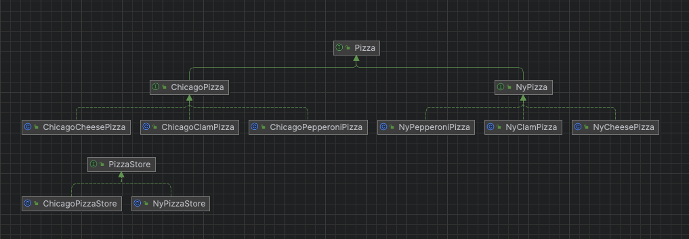
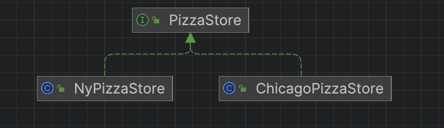

### 요구사항 정리

- Pizza가게는 NyPizza와 ChicagoPizza가 존재한다.
- 서비스는 매우 잘되고 있으며 피자 가게는 계속해서 추가 될 가능성이 존재한다.
- 피자의 종류는 가게마다 전부 달라야 한다.
- 우리는 이러한 피자를 `OrderPizza`에서 `PizzaName`, `PizzaStore`를 기준으로 적절한 피자를 생성해야 한다.

### 피자 모델 구성


- `Pizza` 인터페이스는 모든 피자가 가지고 있어야 할 행위를 추상화한 인터페이스이다.
- `ChicagoPizza` 인터페이스는 시카고 피자에서 가져야할 행위를 추상화한 인터페이스이다.
- `NyPizza` 인터페이스는 Ny 피자에서 가져야할 행위를 추상화한 인터페이스이다.
- 나머지는 각 피자 가게에서 지원하는 피자들이다.

### 피자 가게 구성


- `PizzaStore`는 피자를 생성하는 책임을 가지는 이너페이스이다.
- `NyPizzaStore`는 `NyPizza`를 생성하는 역할을 가진다.
- `ChicagoPizzaStore`는 `ChicagoPizza`를 생성하는 역할을 가진다.

### Client 코드 살펴보기
```java
@Service
public class OrderPizza implements OrderPizzaUseCase {

    private final List<PizzaStore> pizzaStores;

    public OrderPizza(final List<PizzaStore> pizzaStores) {
        this.pizzaStores = pizzaStores;
    }

    @Override
    public Pizza command(final Command command) {
        final String pizzaType = command.pizzaType();
        final String pizzaStore = command.pizzaStore();
        final PizzaStore supportedPizzaStore = pizzaStores.stream()
                .filter(ps -> ps.supports(pizzaType, pizzaStore))
                .findFirst()
                .orElseThrow(() -> new RuntimeException("지원하지 않는 피자 타입, 가게 조합입니다."));

        return supportedPizzaStore.orderPizza(pizzaType);
    }

}
```

### 테스트 코드
```java
@Test
    void NyPizza에서_치즈_피자를_주문한다() {
        String pizzaStoreName = "NyPizzaStore";
        String pizzaType = "NyCheesePizza";

        Pizza pizza = orderPizzaUseCase.command(new OrderPizzaUseCase.Command(pizzaType, pizzaStoreName));
        pizza.prepare();
        pizza.bake();
        pizza.cut();
        pizza.box();
    }

    @Test
    void NyPizza에서_페퍼로니_피자를_주문한다() {
        String pizzaStoreName = "NyPizzaStore";
        String pizzaType = "NyPepperoniPizza";

        Pizza pizza = orderPizzaUseCase.command(new OrderPizzaUseCase.Command(pizzaType, pizzaStoreName));
        pizza.prepare();
        pizza.bake();
        pizza.cut();
        pizza.box();
    }

    @Test
    void NyPizza에서_Clam_피자를_주문한다() {
        String pizzaStoreName = "NyPizzaStore";
        String pizzaType = "NyClamPizza";

        Pizza pizza = orderPizzaUseCase.command(new OrderPizzaUseCase.Command(pizzaType, pizzaStoreName));
        pizza.prepare();
        pizza.bake();
        pizza.cut();
        pizza.box();
    }

    @Test
    void ChicagoPizza에서_치즈_피자를_주문한다() {
        String pizzaStoreName = "ChicagoPizzaStore";
        String pizzaType = "ChicagoCheesePizza";

        Pizza pizza = orderPizzaUseCase.command(new OrderPizzaUseCase.Command(pizzaType, pizzaStoreName));
        pizza.prepare();
        pizza.bake();
        pizza.cut();
        pizza.box();
    }

    @Test
    void ChicagoPizza에서_페퍼로니_피자를_주문한다() {
        String pizzaStoreName = "ChicagoPizzaStore";
        String pizzaType = "ChicagoPepperoniPizza";

        Pizza pizza = orderPizzaUseCase.command(new OrderPizzaUseCase.Command(pizzaType, pizzaStoreName));
        pizza.prepare();
        pizza.bake();
        pizza.cut();
        pizza.box();
    }

    @Test
    void ChicagoPizza에서_Clam_피자를_주문한다() {
        String pizzaStoreName = "ChicagoPizzaStore";
        String pizzaType = "ChicagoClamPizza";

        Pizza pizza = orderPizzaUseCase.command(new OrderPizzaUseCase.Command(pizzaType, pizzaStoreName));
        pizza.prepare();
        pizza.bake();
        pizza.cut();
        pizza.box();
    }

```

- 테스트 코드를 보면 같은 인터페이스를 활용하여 동적으로 원하는 피자 가게에서, 피자를 생성할 수 있다.
- 새로운 지점이 필요하면 `PizzaStore`를 구현한 클래스와 `Pizza`인터페이스를 구현한 피자만 추가하면 됨
