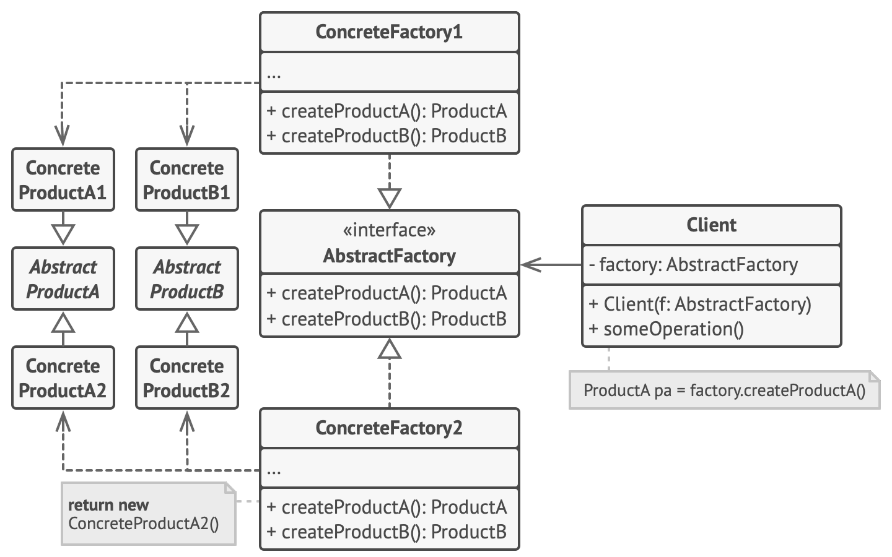

# 4장 : 팩토리 패턴

## 팩토리 메소드 패턴

### 팩토리 메소드 패턴이란?

팩토리 메소드 패턴에서는 객체를 생성할 때 필요한 인터페이스를 만듭니다. 어떤 클래스의 인스턴스를 만들지는 서브클래스에게 결정합니다. 팩토리 메소드 패턴을 사용하면 클래스 인스턴스 만드는 일을 서브클래스에게 맡기게 됩니다.

### 팩토리 메소드 패턴의 구성요소

* Creator : 객체를 생성하는 팩토리 메소드를 선언하는 추상 클래스입니다.
* ConcreteCreator : Creator 클래스를 상속하며, 팩토리 메소드를 구현하여 객체를 생성합니다.
* Product : 팩토리 메소드로 생성될 객체의 인터페이스를 정의합니다.
* ConcreteProduct : Product 클래스를 상속하며, 실제 객체의 구현을 정의합니다.

### 팩토리 메소드 패턴의 장점

* 유연성과 확장성 : 새로운 객체가 필요할 경우, 새로운 ConcreteProduct 클래스를 추가하고, 해당 객체를 생성하는 ConcreteCreator 클래스를 추가하면 됩니다. 이를 통해 기존 코드를 수정하지 않음에도 새로운 객체를 추가할 수 있습니다.
* 결합도 감소 : Creator 클래스는 Product 인터페이스만 사용하기 때문에 클라이언트 입장에서는 생성되는 객체의 구체적인 정보를 알 필요가 없습니다. 즉, 객체 생성과 사용 코드가 분리되어 결합도가 낮아집니다.
* 코드 중복 감소 : 객체 생성 코드가 여러 곳에 중복되는 것을 방지합니다. 객체 생성을 팩토리 메소드에게 위임함으로써 중복 코드를 최소화합니다.

### 팩토리 메소드 패턴의 단점

* 클래스 개수 증가 : 팩토리 메소드 패턴을 사용하면 클래스의 수가 많아집니다.
* 복잡성 : 객체 생성관련 로직들이 여러 클래스에 걸쳐 존재하기 때문에 복잡성이 증가합니다.

## 추상 팩토리 패턴

### 추상 팩토리 패턴이란?

추상 팩토리 패턴은 구상 클래스에 의존하지 않고도 서로 연관되거나 의존적인 객체로 이루어진 제품군을 생산하는 인터페이스를 제공합니다. 구상 클래스는 서브클래스에서 만듭니다.

### 추상 팩토리 패턴의 구성요소

* AbstractFactory : 관련성 있는 여러 종류의 제품군을 생성하기 위한 메소드들을 선언합니다. 이 인터페이스를 구현하는 구체적인 팩토리 클래스들이 실제 객체 생성을 담당합니다.
* ConcreteFactory : AbstractFactory 인터페이스를 구현하여 관련성 있는 여러 종류의 제품군을 생성하는 클래스입니다.
* AbstractProduct : 추상 팩토리로 생성되는 객체들의 공통 인터페이스를 정의합니다.
* ConcreteProduct : AbstractProduct 클래스를 상속하며, 실제 객체의 구현을 정의합니다.

### 추상 팩토리 패턴의 장점

* 관련성 있는 객체들의 생성을 단순화 : 추상 팩토리 패턴은 관련성 있는 여러 종류의 객체를 일관된 방법으로 생성할 수 있습니다. 클라이언트는 제품을 명시하기만 하면 됩니다.
* 교체 가능한 제품군 : 팩토리를 교체함으로써 다른 제품군을 생성하는 것이 가능합니다. 즉, 애플리케이션에서 동적으로 기능을 교체하기 용이합니다.(전략 패턴)
* 단일 책임 원칙 : 객체 생성을 팩토리에 위임함으로써, 클라이언트 코드는 객체 생성과 관련된 책임을 갖지 않아도 됩니다.

### 추상 팩토리 패턴의 단점

* 새로운 제품을 추가하기 어려움 : 새로운 종류의 제품을 추가하려면 팩토리 클래스를 수정해야 합니다. 이는 많은 구현 클래스를 수정해야 하므로 유연성이 떨어질 수 있습니다.
* 복잡성 : 객체 생성과 관련된 로직이 흩어지기 때문에 복잡성이 증가합니다.

## 의존성 역전 법칙

의존성 역전 법칙은 고수준의 모듈은 저수준의 모듈에 의존하면 안되며, 양쪽 모두 추상화에 의존해야한다는 원칙을 의미합니다.

### 팩토리 메소드 패턴의 의존성 역전 법칙

Creator 추상 클래스와 그의 구현체인 ConcreteCreator 모두 Product 인터페이스를 의존함으로써 고수준과 저수준 모듈 모두 추상화에 의존하게 됩니다.

### 추상 팩토리 패턴의 의존성 역전 법칙

Client는 AbstractFactory을 composition을 통해 의존합니다. 또한 각 AbstractFactory와 구현체인 ConcreteFactory 모두 AbstractProduct를 반환함으로써 모든 객체는 추상화에 의존하게 됩니다. 

> 참조 :
> 
> 팩토리 메서드 패턴(https://refactoring.guru/ko/design-patterns/factory-method)
> 
> 추상 팩토리 패턴(https://refactoring.guru/ko/design-patterns/abstract-factory)