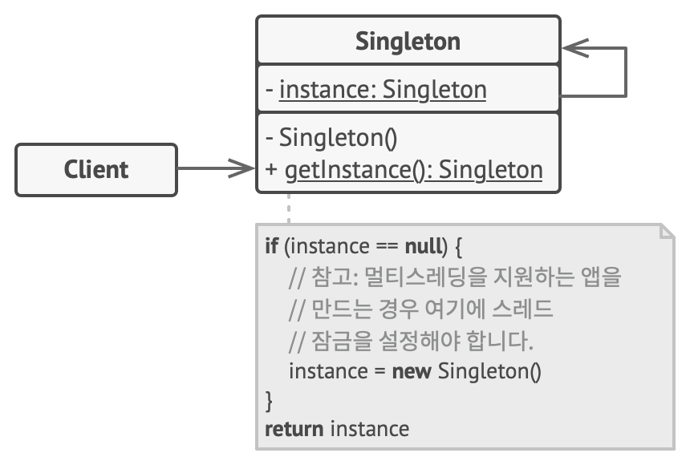

# 5장 싱글턴 패턴

## 싱글턴 패턴이란?

싱글턴 패턴은 클래스 인스턴스를 하나만 만들고, 그 인스턴스로의 전역 접근을 제공합니다.

## 싱글턴 패턴의 구성요소

* 싱글턴 클래스는 정적 메서드 getInstance를 선언합니다. 이 메서드는 자체 클래스의 같은 인스턴스를 반환합니다.

## 싱글턴 패턴의 장점

* 불필요한 객체 생성을 방지하여 성능을 향상시킬 수 있습니다.
* 리소스의 낭비를 줄일 수 있습니다. 객체가 한 번만 생성되므로 메모리와 시스템 리소스를 효율적으로 사용할 수 있습니다.
* 전역 변수 사용을 통해 객체를 관리하기 때문에, 여러 곳에서 동일한 인스턴스에 접근할 수 있습니다.

## 싱글턴 패턴의 단점

* 객체가 전역적으로 공유되기 때문에, 객체 상태에 대한 동기화 문제가 발생할 수 있습니다. 따라서 적절한 동기화 처리가 필요합니다.
* 싱글턴 클래스가 많은 책임을 가지게 되면, 의존성이 높아져 유지보수가 어려워질 수 있습니다.
* 테스트를 여럽게 만들 수 있습니다. 싱글턴 객체는 다른 객체에 대해 의존하기에 테스트시에 mock 객체를 사용하는데 어려움이 있을 수 있습니다.

## 싱글턴 패턴 동시성 제어

우선 지연 초기화를 사용한다면 싱글턴 클래스에서 객체를 생성하는 getInstance() 메소드가 동시에 호출된다면 동시성문제가 생길 수 있습니다. 이를 해결하는 방법으로는 다음과 같습니다.

#### synchronized 이용하기

Java의 synchronized 키워드를 사용하면 동시성 문제를 해결할 수 있습니다. 하지만 synchronized 키워드는 성능에 악영향을 미칠 수 있습니다.

~~~java
public class Singleton {
    private static Singleton instance;
    private Singleton() {}
    public static synchronized Singleton getInstance() {
        if (instance == null) {
            instance = new Singleton();
        }
        return instance;
    }
}
~~~

#### 클래스 로딩 시점에 인스턴스 생성하기

클래스 로딩 시점에 인스턴스를 생성하면 동시성 문제를 해결할 수 있습니다. 하지만 클래스 로딩 시점에 인스턴스를 생성하면서 메모리를 낭비할 수 있습니다.

~~~java
public class Singleton {
    private static Singleton instance = new Singleton();
    private Singleton() {}
    public static Singleton getInstance() {
        return instance;
    }
}
~~~

#### DCL(Double-Checked Locking) 사용하기

DCL을 사용하면 인스턴스가 생성되어 있는지 확인한 다음 생성되어 있지 않았을 때만 동기화할 수 있습니다. 이를 통해 처음에만 동기화하고 나중에는 동기화하지 않아도 됩니다. 

~~~java
public class Singleton {
    private volatile static Singleton instance;
    private Singleton() {}
    public static Singleton getInstance() {
        if (instance == null) {
            synchronized (Singleton.class) {
                if (instance == null) {
                    instance = new Singleton();
                }
            }
        }
        return instance;
    }
}
~~~

> Java의 volatile
>
> volatile 키워드는 메모리 일관성과 스레드 간의 동기화를 보장하기 위해 사용됩니다. volatile 키워드가 붙은 변수는 메인 메모리에 직접 접근하며, 컴파일러와 CPU의 최적화를 제한합니다. 또한 volatile 변수는 스레드 사이에서 가시성을 보장하므로, 한 스레드에서 수정한 변수의 값을 다른 스레드가 즉시 확인할 수 있습니다.
> 
> C 언어의 volatile과의 차이점으로는 Java의 volatile에서 스레드 간의 동기화를 제공한다는 점이 있습니다.

> 참조 
> 
> 싱글턴 패턴(https://refactoring.guru/ko/design-patterns/singleton)