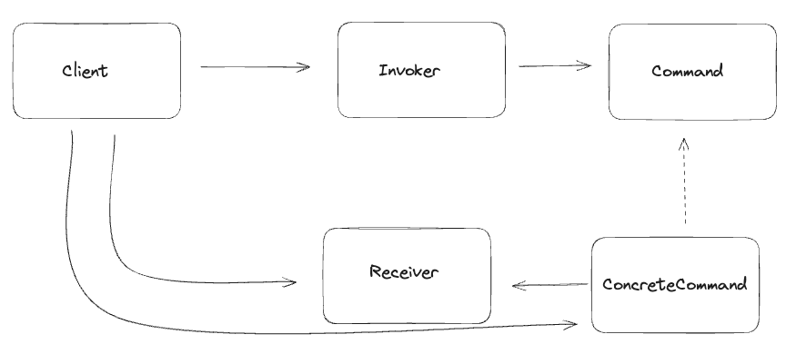

# 커맨드 패턴
> 커맨드 패턴이란 메소드 호출을 캡슐화 하여, 클라이언트와 행위를 분리하는 방식의 패턴  
> 전략패턴보다 추상화 수준이 높은 것이 특징이다.

### 커맨드 패턴 관계도


**Client**
- Command 구현체를 생성하여 Invoker에게 주입해주는 역할을 담당한다.
- Receiver 인스턴스를 포함한 모든 매개변수를 Invoker에게 전달하여 생성해야 한다.

**Invoker**
- Command 인터페이스를 보유한 클래스
- 커맨드 구현체는 Invoker Class의 생성자로 주입되거나 Setter 메소드를 통해 주입된다.
- Invoker의 메소드를 통해 외부에서 Command의 행위를 호출한다. 

**Command**
- 모든 커맨드 객체에서 구현해야하는 인터페이스
- 리시버의 행위는 execute() 메소드를 통해 수행된다.
- 명령을 수행하기 위한 단일 메소드만을 보유한다.

**ConcreteCommand**
- Command 인터페이스의 구현체
- `ConcreteCommand`가 Recevier를 보유한다.
- 구체적인 명령을 자체적으로 수행하는 것이 아닌, Receiver 객체에게 호출을 전달하는 방식으로 수행된다. 
- 인보커에서 execute() 메소드를 호출하면, ConcreteCommand 객체가 리시버의 메소드를 호출하여 작업을 처리한다.

**Receiver**
- Command가 수행해야할 요구사항을 보유하고 있는 객체
- Receiver가 비즈니스에 필요한 행위를 수행한다. 

```java

//Client
public class Client {

    public static void main(String[] args) {
        Light light = new Light();

        Map<RemoteControlType, Command> onCommands = new HashMap<>();

        onCommands.put(RemoteControlType.LIVING_ROOM_LIGHT, new LightOnCommand(light));
        onCommands.put(RemoteControlType.REST_ROOM_LIGHT, new LightOnCommand(light));
        onCommands.put(RemoteControlType.ROOM_LIGHT, new LightOnCommand(light));


        Map<RemoteControlType, Command> offCommands = new HashMap<>();
        offCommands.put(RemoteControlType.LIVING_ROOM_LIGHT, new LightOffCommand(light));
        offCommands.put(RemoteControlType.REST_ROOM_LIGHT, new LightOffCommand(light));
        offCommands.put(RemoteControlType.ROOM_LIGHT, new LightOffCommand(light));

        RemoteInvoker remoteInvoker = new RemoteInvoker(onCommands, offCommands);
        System.out.println("---- 방에있는 ----");
        remoteInvoker.on(RemoteControlType.ROOM_LIGHT);
        remoteInvoker.undo();
        remoteInvoker.on(RemoteControlType.ROOM_LIGHT);
        remoteInvoker.off(RemoteControlType.ROOM_LIGHT);

        System.out.println("---- 거실에 있는 ----");
        remoteInvoker.on(RemoteControlType.LIVING_ROOM_LIGHT);
        remoteInvoker.undo();
        remoteInvoker.on(RemoteControlType.LIVING_ROOM_LIGHT);
        remoteInvoker.off(RemoteControlType.LIVING_ROOM_LIGHT);

        System.out.println("---- 화장실 있는 ----");
        remoteInvoker.on(RemoteControlType.REST_ROOM_LIGHT);
        remoteInvoker.undo();
        remoteInvoker.on(RemoteControlType.REST_ROOM_LIGHT);
        remoteInvoker.off(RemoteControlType.REST_ROOM_LIGHT);
    }
}

//Invoker
public class RemoteInvoker {
    private Map<RemoteControlType, Command> onCommands;
    private Map<RemoteControlType, Command> offCommands;
    private Command undoCommand = new NoCommand();

    public RemoteInvoker(Map<RemoteControlType, Command> onCommands,
                         Map<RemoteControlType, Command> offCommands) {
        this.onCommands = onCommands;
        this.offCommands = offCommands;
    }

    public void on(RemoteControlType type) {
        Command command = onCommands.get(type);
        command.execute();
        undoCommand = command;
    }

    public void off(RemoteControlType type) {
        Command command = offCommands.get(type);
        command.execute();
        undoCommand = command;
    }

    public void undo() {
        undoCommand.undo();
    }
}

public interface Command {
    void execute();
    void undo();
}


//ConcreteCommand
public class LightOnCommand implements Command {

    Light light;

    public LightOnCommand(Light light) {
        this.light = light;
    }

    @Override
    public void execute() {
        light.on();
    }

    @Override
    public void undo() {
        light.off();
    }
}

//Receiver
public class Light {

    private boolean lightOn = false;

    public void on() {
        if (!lightOn) {
            lightOn = true;
            System.out.println("불을 켰습니다.");
        }
    }

    public void off() {
        if (lightOn) {
            lightOn = false;
            System.out.println("불을 껐습니다.");
        }
    }
}


```


### 전략패턴과 커맨드 패턴의 차이
- 전략패턴은 `행위`의 알고리즘을 추상화한 패턴
- 커맨드 패턴은 `행위`를 추상화하여 호출자와 분리한 패턴
- 커맨드 패턴이 전략패턴보다 추상화 수준이 높은 것으로 추측할 수 있다. 

```text
전략패턴은 수행해야할 행위의 규격이 사전에 정해진 반면에  
커맨드 패턴은 리시버가 캡슐화되어 호출자는 행위를 예측할 수 없다. 

전략패턴은 조명을 제어하는 버튼의 업체가 많아지면, 제어하는 행위를 규격으로 지정하고  
각 업체가 해당 규격을 구현하여 동적으로 "버튼의 제어 방식"을 변경하는 것이다. 

커맨드 패턴은 행위 자체가 추상화되어 호출자는 커맨드 패턴이 어떠한 행위를 수행할지 알 수 없다.
리모컨처럼 다양한 역할이 부여되었을 때 커맨드 패턴을 통해 확장이 가능하고 유지보수가 클래스를 설계할 수 있다.
리모컨은 에어컨, 조명, TV 등 규격이 한정되지 않은 다양한 행위를 수행할 수 있다. 

요약하면, 전략패턴은 "특정 대상에 대한 행위(알고리즘)"을 유연하게 변경할 수 있는 패턴이고,
커맨드패턴은 "다양한 행위"를 유연하게 변경할 수 있는 패턴이다.     
```