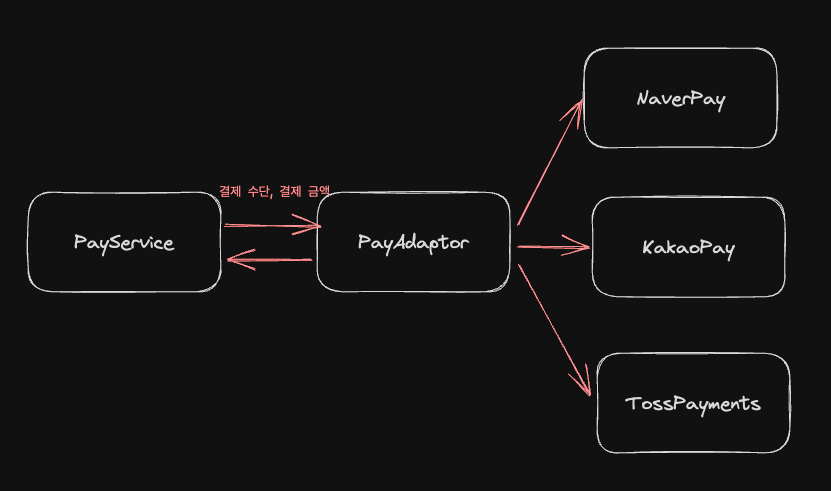
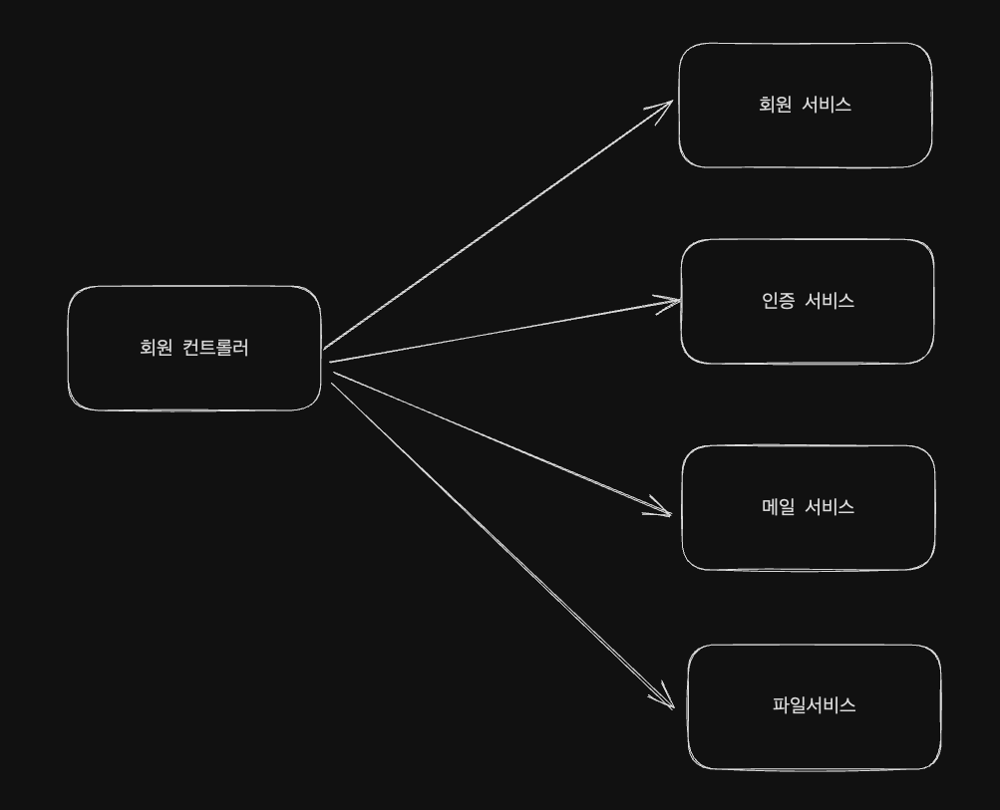
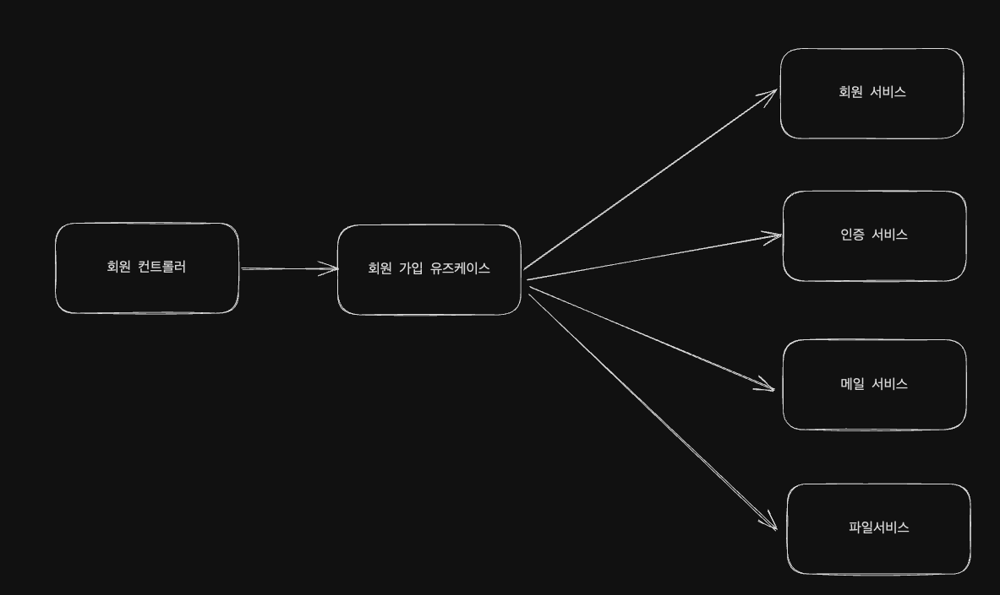

# 어댑터 패턴


<p>
제가 이해한 어댑터 패턴은 같은 역할을 수행하는 다양한 외부 코드를 하나의 인터페이스로 통일시키는 패턴입니다.
저희가 PayService를 구현한다고 가정해보겠습니다.

<h3>사용자 입력</h3>
- 결제 수단, 결재 금액

<h3>출력</h3>
- 결제 성공 여부
</p>

```java
public class NaverPay {
    public NaverPayResponse pay(long amount) {
        // 카드사 통신 및 응답
    }
}

public class KakaoPay {
    public KakaoPayResponse pay(long amount) {
        // 카드사 통신 및 응답
    }
}

public class TossPayments {
    public TossPayments pay(long amount) {
        // 카드사 통신 및 응답
    }
}
```

<p>
위 클래스는 상황을 가정하기 위해서 만들어진 클래스로 3개의 페이먼츠 시스템에서 돌려주는 응답이 모두 다른 상황을 가정 했습니다.
</p>


```java
public class PaymentsAdaptor {
    
    public Money pay(String paymentsType, long amount) {
        Money money;
        
        if(paymentsType.equals("카카오페이")) {
            money = kakaopay.pay(amount).toMoney();
        } else if (paymentsType.equals("네이버페이")) {
            money = naverpay.pay(amount).toMoney();
        } else if(paymentsType.equals("토스 페이먼츠")) {
            money = tosspayments.pay(amount).toMoney();
        }
        
        return money;
    }
}
```
<p>
중간에 어댑터를 두어서 다양한 외부 회사와의 API 연동 후 데이터를 일관된 방식으로 반환하게 합니다. <br>
어댑터를 둠으로써 동일한 개념이지만 데이터 메소드 시그니처가 다른 여러 클래스를 일관된 방식으로 사용할 수 있게 합니다.
</p>

# 퍼사드 패턴

<p>
제가 이해한 퍼사드 패턴은 여러가지 복잡한 시스템을 묶어주는 추상화 계층을 하나 더 추가하는 방법입니다. <br>
가볍게 이해하기로는 레이어드 아키텍처에서 레이어를 하나 더 추가하는 방식으로 이해 했습니다.
</p>



<p>
저는 이전에 위와 같은 구조로 코드를 작성 했습니다. <br>
이런 아키텍처를 사용하다보니 회원 서비스에서 회원 가입을 하기 위해서 파일 서비스를 알아야 하는 등 하나의 서비스가 다른 서비스를 참조하는 현상이 자주 발생 했습니다.
</p>



<p>
그래서 저는 유즈케이스라는 계층을 추가하여 각 서비스가 다른 서비스에 대해 알 필요가 없는 구조로 개선을 시도 했습니다. <br>
이렇게 하면 단점은 컨트롤러 레이어가 많은 유즈케이스를 알아야 한다는 단점이 있지만, 각 서비스를 작게 유지하는데 도움이 되었고 이는 순환참조가 발생할 가능성을 줄이는 효과를 보았다고 개인적으로 생각하게 되었습니다.
</p>