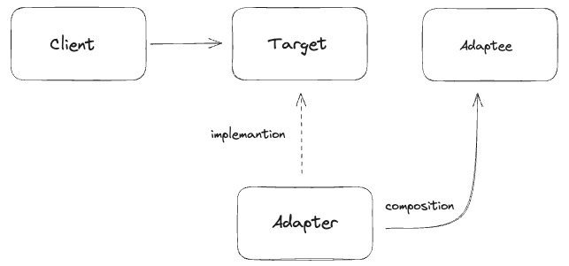
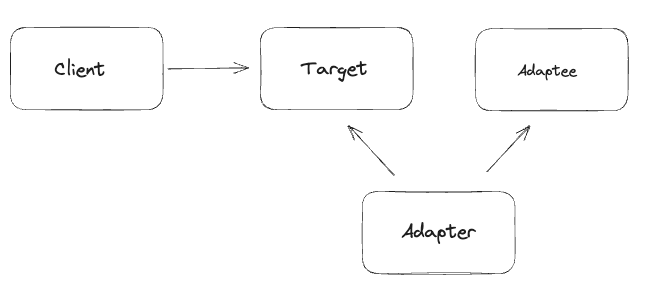
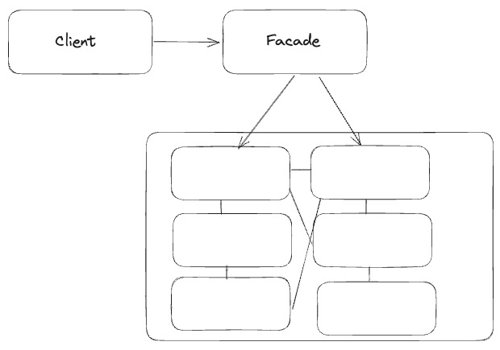

# 어댑터 패턴
> 어댑터 패턴이란 제공해야할 인터페이스가 클라이언트가 사용해야 하는 인터페이스 규격과 다를 때  사용하는 패턴  
> 기존 인터페이스를 어댑터 클래스가 구현하고 어댑터 내부에 어댑티 클래스를 구성하는 구조로 이뤄져 있음 (객체 구성 방식)

### 어댑터 패턴 사용해보기
```java

//target 
public interface Duck {
    void quack();
    void fly();
} 

//adaptee 
public interface Turkey {
    void gobble();
    void fly();
}

//concreteAdaptee 
public class WildTurkey implements Turkey {
    void gobble() {
        System.out.println("터키 울음소리");
    }
    
    void fly() {
        System.out.println("짧은 거리를 날고있다");
    }
}

//adepter 
public class DuckAdapter implements Duck {
    private Turkey turkey;
    
    public DuckAdapter(Turkey turkey) {
        this.turkey = turkey;
    }
    
    void quack() {
        turkey.gobble();
    }
    
    void fly() {
        turkey.fly();
    }
}
```


### Target
- 어댑터가 구현할 인터페이스
- 기존 클라이언트가 사용하고 있던 인터페이스 규격

### Adaptee
- 어댑터 내부에서 호출 될 인터페이스
- Adepter 내부에서 Target 메소드 내부에 감싸여진 상태로 호출 된다

### Adepter
- Adeptee 클래스를 클라이어느에서 요구하는 다른 인터페이스로 변환해주는 역할
- Target 클래스를 구현하고 Adeptee의 메소드를 호출한다


## 객체 어댑터
- 앞에서 소개한 예제는 객체 어댑터 방식이다
- 객체 어댑터는 `상속`이 아닌 `구성`을 통해 어댑티의 기능을 제공한다
- 객체 어댑터는 어댑티 기능에 대한 확장성이 열려있다 

### 객체 어댑터 구성도


## 클래스 어댑터
- 클래스 어댑터는 다중 상속 언어에서 자주 사용되는 방식이다
- 클래스 어댑터는 어댑티를 상속하는 방식으로 구현되기 때문에 특정 어댑티 클래스의 기능만 사용이 가능하다
  - 어댑티 클래스가 필요 없어짐 (상속을 통해 어댑티 클래스의 기능을 제공하기 때문)

### 클래스 어댑터 구성도



## 파사드 패턴 맛보기
> 쓰기 쉬운 인터페이스를 제공하는 파사드 클래스를 구현함으로써 복잡한 시스템을 편리하게 사용하도록 제공하는 패턴  
> 특정 행위를 수행할 때 필요한 서브 시스템의 일련의 행위들을 파사드 클래스의 메소드에 응집하여 제공하는 방식  
> 요약하면 서브 시스템의 간단한 인터페이스를 제공하는 용도로 사용된다

### 파사드 구성도



### 예시
**[기존 영화관 시스템]**
```java
public class client {

    public static void main(String[] args) {
        팝콘기계 카라멜 = new 팝콘기계();
        스크린 아이맥스 = new 스크린();
        영화 스즈메 = new 영화();
        
        카라멜.팝콘_만들기();
        카라멜.팝콘_담기();
        아이맥스.스크린_켜기();
        스즈메.영화_재생_하기();
    }
}

public class 팝콘기계 {
    void 팝콘_만들기() {
        System.out.println("팝콘 만드는 중");
    }
    
    void 팝콘_담기() {
        System.out.println("팝콘 담는 중");
    }
}

public class 스크린 {
    void 스크린_켜기() {
        System.out.println("스크린 키는 중");
    }
}

public class 영화 {
    void 영화_재생_하기 () {
        System.out.println("영화 재생 주");
    }
}
```

**[파사드 영화관 시스템]**

```java
public class client {

    public static void main(String[] args) {
        팝콘기계 카라멜 = new 팝콘기계();
        스크린 아이맥스 = new 스크린();
        영화 스즈메 = new 영화();
        
        MovieFacade movieFacade 
                = new MovieFacade(카라멜, 아이맥스, 스즈메);

        movieFacade.영화_시작();
    }
}

public class MovieFacade {
    private 팝콘기계 팝콘기계;
    private 스크린 스크린;
    private 영화 영화;
    
    public MovieFacade(팝콘기계 팝콘기계, 스크린 스크린, 영화 영화) {
        this.팝콘기계 = 팝콘기계;
        this.스크린 = 스크린;
        this.영화 = 영화;
    }
    
    void 영화_시작() {
        카라멜.팝콘_만들기();
        카라멜.팝콘_담기();
        아이맥스.스크린_켜기();
        스즈메.영화_재생_하기();
    }
}

public class 팝콘기계 {
    void 팝콘_만들기() {
        System.out.println("팝콘 만드는 중");
    }
    
    void 팝콘_담기() {
        System.out.println("팝콘 담는 중");
    }
}

public class 스크린 {
    void 스크린_켜기() {
        System.out.println("스크린 키는 중");
    }
}

public class 영화 {
    void 영화_재생_하기 () {
        System.out.println("영화 재생 주");
    }
}
```

