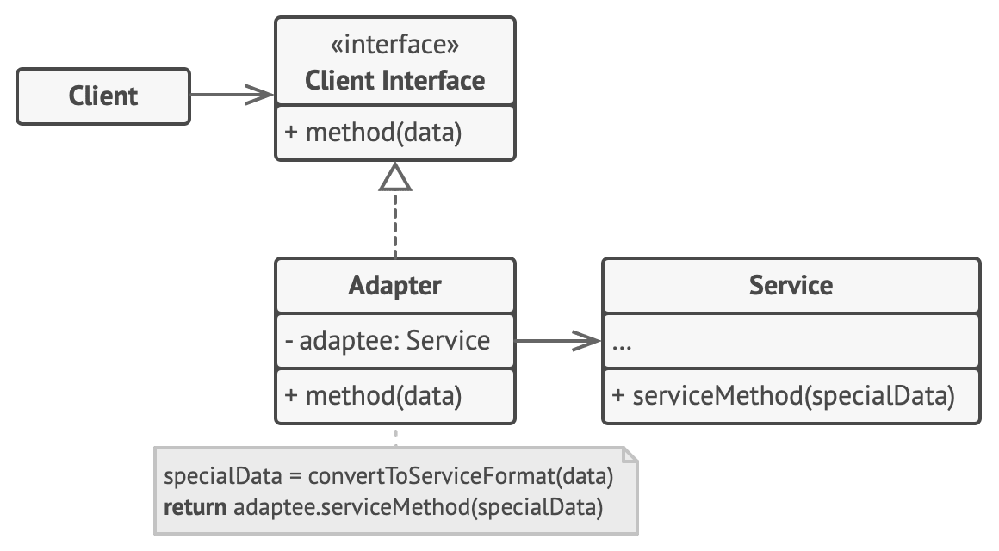

# 7장 어댑터 패턴과 퍼사드 패턴

## 어댑터 패턴

### 어댑터 패턴이란?

어댑터 패턴은 호환되지 않는 인터페이스를 가진 객체들이 협업할 수 있도록 하는 구조적 디자인 패턴입니다.

어댑터 패턴에는 두 가지 종류가 있습니다.
* 객체 어댑터 패턴 : 객체 어댑터 클래스가 타겟 인터페이스를 구현하면서, 어댑티 클래스의 인스턴스를 내부에 포함하는 방식입니다.(Composition) 내부에 포함된 어댑티 인스턴스를 활용하여 타겟 인터페이스 메서드를 구현합니다.
* 클래스 어댑터 패턴 : 클래스 어댑터는 다중 상속을 통해 어댑터 클래스가 타겟 인터페이스와 어댑티 클래스를 동시에 상속받는 방식입니다. 이때 어댑티 클래스의 기능을 타겟 인터페이스에 맞게 변환하는 역할을 수행합니다.

### 객체 어댑터 패턴 구조

* Client Interface : Client Interface는 Adapter가 타겟으로 지원할 인터페이스 입니다. 클라이언트 코드가 사용하는 인터페이스입니다.
* Adapter : Adapter 클래스는 Client Interface를 구현하며, 내부에 어댑티 클래스(Service)의 인스턴스를 포함합니다. 이 클래스의 메서드는 Client Interface의 메소드를 구현하면서 내부 어댑티 인스턴스의 메서드를 호출하여 기능을 전달하게 됩니다.
* Service : Service는 어댑티 클래스로 기존에 사용하던 클래스나 모듈로서, 클라이너트 코드가 직접 사용하기에는 타겟 인터페이스와 호환되지 않는 경우를 나타냅니다.

### 클래스 어댑터 패턴 구조

// 클래스 어댑터 패턴의 구성요소
* Existing : Existing은 기존에 사용하던 클래스나 모듈로서, Service와 호환되지 않는 경우를 나타냅니다.
* Adapter : Adapter 클래스는 Existing 클래스와 Service 클래스 모두 상속받는 다중 상속 클래스 입니다. 이 클래스의 메서드는 Existing 클래스의 메서드를 호출하면서, Service 클래스의 메서드를 호출하여 기능을 전달하게 됩니다.
* Service : Service는 어댑티 클래스로 기존에 사용하던 클래스나 모듈로서, 클라이너트 코드가 직접 사용하기에는 타겟 인터페이스와 호환되지 않는 경우를 나타냅니다.

### 어댑터 패턴의 장점

* 개방/폐쇄 원칙 : 어댑터 패턴을 사용하면 기존의 클래스나 모듈을 수정하지 않고도 새로운 인터페이스에 맞게 사용할 수 있습니다.
* 인터페이스 호환성 : 호환되지 않는 두 개의 인터페이스 사이의 변환 작업을 어댑터 패턴을 통해 처리할 수 있습니다.
* 유연성 : 어댑터 클래스를 통해 새로운 요구사항에 대한 대응이 쉽습니다.

### 어댑터 패턴의 단점

* 성능 저하 : 어댑터를 사용하면 중간에서 변환 작업이 발생하므로 일부 성능 저하기 발생할 수 있습니다.
* 과도한 사용 : 너무 많은 어댑터를 사용하면 코드가 복잡해질 수 있습니다. 따라서 적절한 상황에서 사용하는 것이 중요합니다.

## 퍼사드 패턴

### 퍼사드 패턴이란?

퍼사드 패턴은 라이브러리에 대한, 프레임워크에 대한 또는 다른 클래스의 복잡한 집합에 대한 단순화된 인터페이스를 제공하는 구조적 디자인 패턴입니다.

### 퍼사드 패턴의 구조

* Facade : Facade 클래스는 복잡한 서브시스템의 인터페이스를 단순화시켜 제공하는 역할을 합니다. 클라이언트는 퍼사드를 통해 서브시스템과 상호작용하며, 퍼사드가 제공하는 메서드를 호출하여 복잡한 과정을 추상화된 방식으로 처리합니다.
* Additional Facade : Additional Facade는 하나의 Facade 클래스가 복잡한 서브시스템을 단순화시키는 것이 어려운 경우, Facade 클래스를 보조하는 역할을 합니다.
* Subsystem : Subsystem은 퍼사드에서 단순화된 인터페이스를 제공하기 위해 사용되는 실제 기능을 가지고 있는 클래스나 모듈들을 포함합니다.

### 퍼사드 패턴의 장점

* 복잡성 감소 : 퍼사드를 통해 복잡한 시스템 내부를 숨기고 단순화된 인터페이스를 제공함으로써 클라이언트 코드의 복잡성을 감소시킵니다.
* 모듈성과 유연성 : 서브시스템 내부 구현이 변경되어도 퍼사드의 인터페이스는 변경되지 않으므로 시스템의 모듈성과 유연성을 높일 수 있습니다.

### 퍼사드 패턴의 단점

* 유연성 제한 : 퍼사드는 특정한 사용 사례를 고려하여 설계되므로, 서브시스템의 모든 기능을 활용하려면 퍼사드를 수정해야 할 수 있습니다.
* 성능 저하 : 퍼사드를 통해 여러 기능을 호출학 되면 추가적인 호출 오버헤드가 발생할 수 있습니다.
* 과한 결합 : 퍼스드 패턴을 사용하면 모든 클래스와 결합된. 즉, 많은 클래스와 결합된 객체가 생성될 수 있습니다.

## 최소 지식 원칙

데메테르의 원칙이라고도 불리는 객체 지향 프로그래밍 설계 원칙중 하나입니다.

최소 지식 원칙은 "모듈은 자신이 조작하는 객체에 관한 세부 사항을 최소화해야 한다"로 정의됩니다.

최조 지식 원칙은 다음의 내용을 강조합니다.
* 클래스나 모듈은 자신의 멤버(필드, 메소드)에만 직접적인 접근을 해야합니다.
  * 다른 객체의 내부 멤버에 직접 접근하거나 변경하지 말아야 합니다.
* 메서드에서는 매개변수로 전달된 객체의 메서드만 호출해야 합니다.
  * 메서드에서 반환된 객체의 메소드도 호출 가능하지만, 그 반환 객체에 의해 다시 반환된 객체의 메서드까지 호출하는 것은 피해야 합니다.
* 메서드 체인을 최대한 짧게 유지해야 합니다.
  * 객체 간의 의존 관계가 복잡하게 연결되는 메소드 체인을 피해야 합니다.

### 최소 지식 원칙의 장점

* 결합도 감소 : 최소 지식 원칙을 준수하면 객체 간의 결합도가 낮아지며, 코드의 유연성과 재사용성이 증가합니다.
* 유지보수 용이성 : 객체 간의 의존성이 줄어들면서, 다른 객체를 변경할 때 해당 변경이 다른 객체에 영향을 미치는 범위가 줄어듭니다.

### 최소 지식 원칙의 단점

* 불필요한 중간 객체를 추가 생성하게 되어 성능이 저하될 수 있습니다.

> 참조:
>
> 어댑터 패턴(https://refactoring.guru/ko/design-patterns/adapter)
> 
> 퍼사드 패턴(https://refactoring.guru/ko/design-patterns/facade)