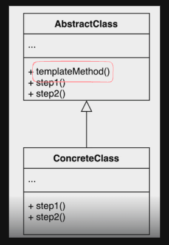

# 템플릿 메소드 패턴

 <br>

- 템플릿 메소드 패턴이란 알고리즘 구조를 서브 클래스가 확장할 수 있도록 템플릿으로 제공하는 기법이다.
- 템플릿 메소드 패턴을 이용하면 코드의 중복을 제거할 수 있으며 공통된 로직의 추상화가 가능하다.


```java
public class HelloServlet extends HttpServlet {
    @Oveerride
    protected void doGet(HttpServletRequest req,HttpServletResponse res) throws Exception {

    }
}
```

대표적인 예시로 서블릿을 프로그래밍을 할 때 서블릿을 상속 받아서 로직을 구현하는 것이 존재한다.

```java
abstract class Beverage {
    // 템플릿 메소드
    final void prepareBeverage() {
        boilWater();
        brew();
        pourInCup();
        addCondiments();
    }

    // 하위 클래스에서 구현해야 하는 메소드들
    abstract void brew();
    abstract void addCondiments();

    void boilWater() {
        System.out.println("물 끓이는 중");
    }

    void pourInCup() {
        System.out.println("컵에 따르는 중");
    }
}

class Coffee extends Beverage {
    @Override
    void brew() {
        System.out.println("필터를 통해 커피 내리는 중");
    }

    @Override
    void addCondiments() {
        System.out.println("설탕과 우유를 추가하는 중");
    }
}

class Tea extends Beverage {
    @Override
    void brew() {
        System.out.println("차를 우려내는 중");
    }

    @Override
    void addCondiments() {
        System.out.println("레몬을 추가하는 중");
    }
}

public class TemplateMethodPatternExample {
    public static void main(String[] args) {
        Beverage coffee = new Coffee();
        Beverage tea = new Tea();

        System.out.println("커피 만들기 시작");
        coffee.prepareBeverage();
        System.out.println("차 만들기 시작");
        tea.prepareBeverage();
    }
}
```

템플릿 메소드 패턴을 사용하면 공통된 알고리즘의 구조를 중복 없이 재사용할 수 있다는 장점이 있다.

### 장점

- 템플릿 코드를 재사용하고 중복 코드를 줄일 수 있다.
- 템플릿 코드를 변경하지 않고 상속을 받아서 구체적인 알고리즘만 변경할 수 있다.

### 단점

- 알고리즘 구조가 복잡하면 유지하기 어렵다.
- 하위클래스 디자인에 제약을 가할 수 있다.
