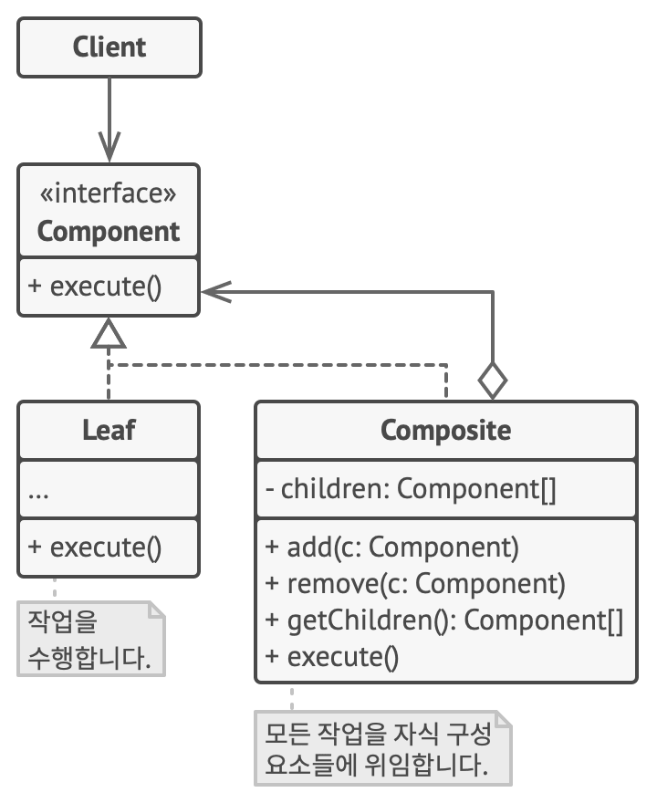

# 9장 반복자 패턴과 컴포지트 패턴

## 반복자 패턴(Interator Pattern)

### 반복자 패턴이란?

* 반복자 패턴은 컬렉션(데이터 집합)의 요소를 순차적으로 접근하고 조작하기 위한 일관된 방법을 제공하는 패턴입니다.
* 반복자 패턴은 컬렉션의 내부 구조와 상관없이 요소에 접근할 수 있도록 합니다.

### 반복자 패턴의 구성 요소

* 반복자(Iterator) : 컬렉션 내의 요소를 순서대로 접근하는 인터페이스를 정의합니다. 이 인터페이스는 다음 요소로 이동하고, 현재 요소를 가져오는 메소드를 포함합니다.
* 집합체(IterableCollection) : 요소를 가지고 있는 컬렉션을 나타내는 인터페이스를 정의합니다. 이 인터페이스는 반복자를 생성하는 메소드를 제공합니다.
* 구체적인 반복자(Concrete Iterator) : 반복자 인터페이스를 구현한 클래스로, 특정 컬렉션 타입에 맞게 요소에 접근하고 순회하는 역할을 합니다.
* 구체적인 집합체(ConcreteCollection) : 집합체 인터페이스를 구현한 클래스로, 실제로 데이터를 저장하고 반복자를 생성하는 역할을 합니다.

### 반복자 패턴의 장점

* 캡슐화 강화 : 컬렉션의 내부 구조를 외부로부터 숨기고, 컬렉션을 순회하거나 조작하는 데 필요한 인터페이스만 노출합니다.
* 확장성 및 유연성 : 새로운 반복 방식이나 컬렉션 유형을 추가하기 쉽습니다. 새로운 반복자를 구현하거나 새로운 집합체를 만들어 기존 코드에 영향을 주지 않고 새로운 기능을 추가할 수 있습니다.
* 다양한 순회 방법 제공 : 다양한 순회 방법(전방, 후방, 특정 조건을 만족하는 요소만 순회 등)을 제공할 수 있습니다.
* 동기화 : 여러 스레드에서 안전하게 컬렉션을 순회하고 조작할 수 있도록 동기화 기능을 구현할 수 있습니다.

### 반복자 패턴의 단점

* 복잡성 증가 : 반복자 패턴을 구현하면 코드의 일부가 복잡해질 수 있습니다. 특히 집합체가 복잡한 경우 반복자를 구현하는 것이 번거로울 수 있습니다.
* 성능 : 일부 반복자 구현은 성능을 저하시킬 수 있으며, 모든 상황에 맞지 않을 수 있습니다. 때로는 직접 루프를 작성하는 것이 더 효율적일 수 있습니다.

## 컴포지트 패턴(Composite Pattern)

### 컴포지트 패턴이란?

* 컴포지트 패턴은 부분-전체 계층 구조를 표한하는 데 사용됩니다.
* 이 패턴은 개별 객체와 객체 그룹(집합체)을 동일한 방법으로 취급하여 클라이언트 코드가 객체와 객체 그룹을 구별하지 않고 사용할 수 있도록 합니다.
* 주로 트리 구조와 같은 계층적 구조를 표현하거나 복합적인 객체를 처리할 때 사용됩니다.

### 컴포지트 패턴의 구성 요소

* 컴포넌트(Component) : 복합체 패턴의 모든 구성 요소에 대한 공통 인터페이스를 정의합니다. 이 인터페이스는 개별 객체와 집합체 모두에서 구현합니다.
* 리프(Leaf) : 개별 객체를 나타내며, 컴포넌트 인터페이스를 구현합니다. 이 객체는 더 이상 하위 객체를 가지지 않습니다.
* 컴포지트(Composite) : 집합체를 나타내며, 컴포넌트 인터페이스를 구현합니다. 이 객체는 하위 객체의 컬렉션을 관리하고, 이 하위 객체들을 자체적으로 컴포넌트 인터페이스를 구현합니다.

### 컴포지트 패턴의 장점

* 일관성 : 개별 객체와 복합 객체 모두 동일한 인터페이스를 공유하므로 클라이언트 코드에서 일관된 방식으로 처리할 수 있습니다.
* 재귀 구조 : 복합체 패턴은 트리 구조나 계층 구조를 모델링하기에 적합하며, 객체 간의 복잡한 관계를 나타낼 수 있습니다.
* 유연성 : 새로운 구성 요소를 쉽게 추가할 수 있으며, 복합 객체를 넣는 등의 유연한 구조를 갖을 수 있습니다.
* 클라이언트 코드 단순화 : 클라이언트 코드에서 객체와 그룹을 구분하지 않고 일관된 방법으로 처리할 수 있으므로 코드가 단순해집니다.

### 컴포지트 패턴의 단점

* 복잡성 : 대규모 복합체 구조를 구현할 때 복잡성이 증가할 수 있습니다. 객체 간의 관계를 관리하고 유지하는 것이 어려울 수 있습니다.
* 퍼포먼스 : 복합체 패턴은 개별 객체와 집합체를 동일하게 처리하므로, 일부 경우에는 성능 저하를 초래할 수 있습니다.

> 참조
> 
> 반복자 패턴(https://refactoring.guru/ko/design-patterns/iterator)
>
> 복합체 패턴(https://refactoring.guru/ko/design-patterns/composite)