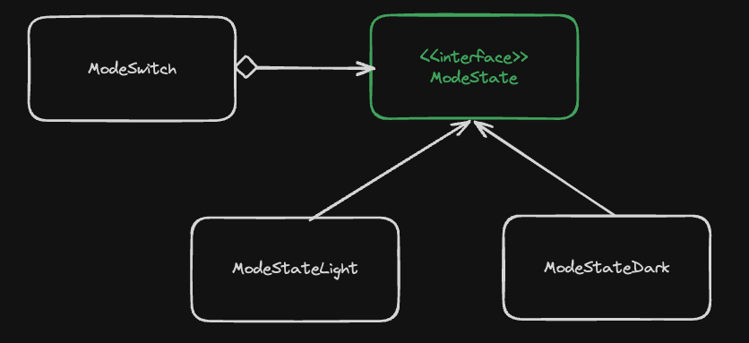

# 상태 패턴

 <br>

상태패턴은 객체가 특정 상태에 따라 행위를 달리하는 상황에서 상태를 객체화하여 상태가 행동을 할 수 있도록 위임하는 패턴을 말한다.

<br>

일반적으로 구현하는 방법에는 상태에 따라 해야하는 행위 자체를 추상화한다.  
그리고 각 행위에 해당하는 다른 구체 클래스들을 구현한다.  
각 구체클래스는 알고리즘을 수행한 후 필요에따라 클라이언트 코드의 상태를 변경한다.

```java
public class Main {
    public static void main(final String[] args) {
        final ModeSwitch modeSwitch = new ModeSwitch();

        modeSwitch.onSwitch(); // FROM LIGHT TO DARK
        modeSwitch.onSwitch(); // FROM LIGHT TO LIGHT
        modeSwitch.onSwitch(); // FROM LIGHT TO DARK
        modeSwitch.onSwitch(); // FROM LIGHT TO LIGHT
    }
}

class ModeSwitch {

    private ModeState modeState = new ModeStateLight()

    public void setState(ModeState modeState) {
        this.modeState = modeState;
    }

    public void onSwitch() {
        modeState.toggle(this);
    }
}

public interface ModeState{
    public void toggle(ModeSwitch modeSwitch);
}

class ModeStateLight implements ModeState {
    public void toggle(ModeSwitch modeSwitch) {
        System.out.println("FROM LIGHT TO DARK");
        // 화면을 어둡게 하는 코드
        modeSwitch.setState(new ModeStateDark());
    }
}

class ModeStateDark implements ModeState {
    public void toggle(ModeSwitch modeSwitch) {
        System.out.println("FROM LIGHT TO DARK");
        // 화면을 하얗게 하는 코드
        modeSwitch.setState(new ModeStateLight());
    }
}
```
