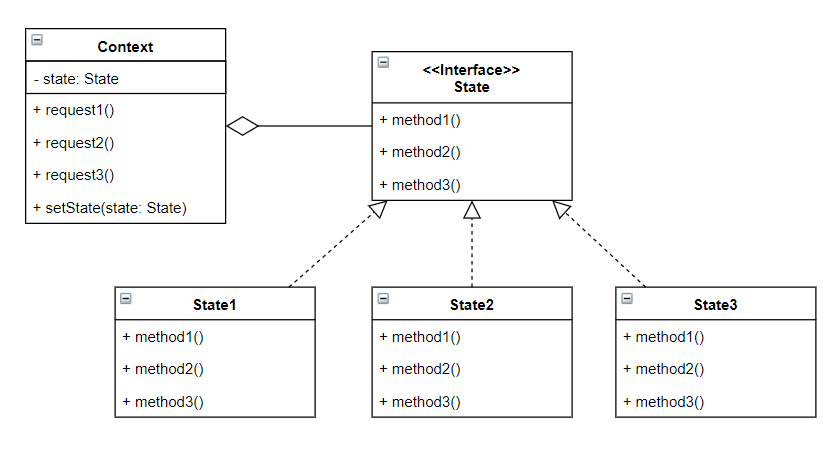

# 상태 패턴
> 상태 패턴은 내부 상태를 바꿈으로써 객체가 행동을 변경할 수 있도록 도와준다.  
> 전략패턴과 상태패턴은 서로 용도가 다르지만, 배경 설계는 거의 비슷하다.

### 상태패턴이 없다면?
상태패턴은 각 상태에 따라 행위가 변경될 때 사용하는 것이 적합하다.  동일한 상황에서 상태패턴을 사용하지 않으면  
각 상태마다 분기문으로 처리하여 행위를 수행하게 될 것이다. 이 방식은 상태가 추가될 때마다 분기문도 추가되어야 하기 때문에 비효율적이다.

### 상태패턴
  
- 상태패턴은 상태별 행동을 별도의 클래스에 저장해두고 각 상태에 맞는 행위를 실행한다.
  - 상태패턴은 클라이언트 코드에 `상태별 행동을 구성한다`
- 상태를 하나의 클래스에 저장해두기 때문에 행동을 국지화 할 수 있다. 
  - 코드를 이해하기 쉽고 새로운 상태를 추가하기 쉽다.
- 객체의 내부 상태가 바뀜에 따라서 객체의 행동을 변경할 수 있다.
- 내부에서 상태에 따른 행위를 선택하여 실행하기 때문에 전략패턴과 유사하게 느껴질 수 있다.

### 상태패턴과 전략패턴
**[상태패턴]**
- 상태패턴은 상태 객체의 일력의 행동이 캡슐화된다. 상황에 따라 상태객체 중 한 객체에게 모든 행동을 맡기는 것이다.
- 내부 상태에 따라 행위가 변경되기 때문에 클래이언트는 상태를 몰라도 된다.

**[전략패턴]**
- 전략패턴은 일반적으로 클라이언트가 Context 객체에게 어떤 전략을 사용할지 지정한다.
- 전략패턴은 실행시에 전략 객체를 변경할 수 있는 유연함을 제공하는 것이 중요하다. 
- 상태패턴은 Context가 행위를 지정하지만, 전략패턴은 클라이언트가 수행할 행위를 선택한다. 
