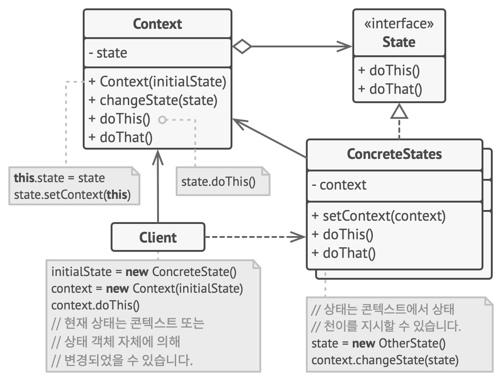

# 10장 상태 패턴(State Pattern)

## 상태 패턴이란?

* 상태 패턴은 객체의 내부 상태가 변경될 때 해당 객체가 그의 행동을 변경할 수 있도록 하는 행동 디자인 패턴입니다.
* 객체가 행동을 변경할 때 객체가 클래스를 변경한 것처럼 보일 수 있습니다.
* 상태 패턴은 유한 상태 기계(Finite State Machine, FSM) 개념과 밀접하게 관련되어 있습니다.

## 상태 패턴 구성 요소

* Context(컨텍스트) : 상태 패턴을 사용하는 객체를 포함하는 클래스로, 해당 객체의 상태를 추적하고 상태에 따라 동작을 위임하는 역할을 합니다.
* State(상태) : 상태 패턴에서 정의되는 상태 객체들의 추상 클래스 또는 인터페이스 입니다. 각 구체적인 상태 클래스는 특정 상태에서 실행되는 행동을 구현합니다.
* Concrete State(구체적인 상태) : State 인터페이스를 구현하는 클래스로, 특정 상태에서의 동작을 정의합니다.

## 상태 패턴의 장점

* 유지 보수성 : 상태 패턴을 사용하면 새로운 상태를 추가하거나 기존 상태를 변경하기 쉽습니다. 이를통해 코드의 확장성과 유지 보수성이 향상됩니다.
* 가독성 : 객체의 상태와 상태에 따른 동작이 명확하게 정의되므로 코드가 더 읽기 쉽고 이해하기 쉽습니다.
* 상태 전이 관리 : 상태 패턴을 사용하면 상태 전이 로직을 중앙에서 관리하므로 버그나 오류 발생 가능성이 줄어듭니다.

## 상태 패턴의 단점

* 클래스 증가 : 상태 패턴을 구현하려면 많은 상태 클래스와 상태 전이 로직을 만들어야 할 수 있으므로 클래스의 수가 늘어날 수 있습니다. 이로인해 프로젝트의 복잡성이 증가할 수 있습니다.
* 복잡성 : 복잡한 생태 기계를 다룰 때 상태 패턴을 사용하면 코드가 복잡해질 수 있으며, 이를 관리하는 데 추가 노력이 필요합니다.
* 상태 공유 : 객체 간의 상태를 공유해야 할 때 상태 패턴은 적합하지 않을 수 있습니다.

## 상태 패턴 VS 전략 패턴

* 상태 패턴은 전략 패턴의 확장으로 생각할 수 있습니다. 두 패턴 모두 합성을 기반으로 합니다.
* 상태 패턴은 객체의 상태에 집중하여 동작을 변경하거나 제어하는 데 사용됩니다.
* 상태 패턴은 구상 상태들 사이의 의존 관계들을 제한하지 않으므로 상태들은 콘텍스트의 상태를 마음대로 변경할 수 있습니다.
* 전략 패턴은 객체의 행동에 집중하여 다양한 알고리즘 또는 전략을 동적으로 선택하거나 교체하는 데 사용됩니다.
* 전략 패턴은 객체들을 완전히 독립적으로 만들어 서로를 인식하지 못하도록 만듭니다.

> 참조
> 
> 상태 패턴(https://refactoring.guru/design-patterns/state)