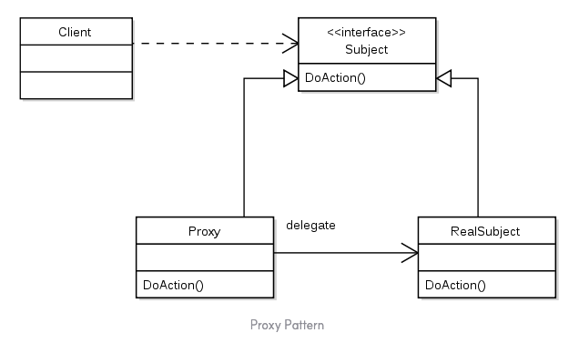

# Proxy Pattern



프록시 패턴은 다른 무언가와 이어지는 인터페이스의 역할을 하는 패턴이다.  
프록시 패턴을 적용하면 외부에게 메서드를 노출하지 않고 로직의 흐름을 제어할 수 있다.  
아래 예제는 인터넷 접속을 차단하는 예제 코드이다.

```java
interface Internet {
    String connectTo(String serverHost);
}

public class RealInternet implements Internet {
    @Override
    public String connect(final String serverHost) {
        return String.format("Connecting to %s", serverHost)
    }
}

public class ProxyInternet implements Internet {
    private static List<String> bannedSite = Lists.newArrayList("abc.com", "def.com", "ijk.com");
    private Internet internet = new RealInternet();

    @Override
    public String connectTo(final String serverHost) {
        if (bannedSite.contains(serverHost.toLowerCase())) {
            throw new IllegalArgumentException(String.format("해당하는 호스트는 접근이 불가능합니다 : %s", serverHost));
        }

        return internet.connectTo(serverHost);
    }
}

```
