# 14장 기타 패턴

## 브리지 패턴

### 브리지 패턴이란?

* 브리지 패턴은 큰 클래스 또는 밀접하게 관련된 클래스들의 집합을 두 개의 개별 계층구조(추상화 및 구현)로 나눈 후 각각 독립적으로 개발할 수 있도록 하는 구조 디자인 패턴입니다.

### 브리지 패턴 구성 요소

* Abstraction(추상화) : 상위 수준의 제어 논리를 제공하며, 구현 객체에 의존해 실제 하위 수준 작업들을 수행합니다.
* Implementation(구현) : 모든 구상 구현들에 공통적인 인터페이스를 선언하며, 추상화는 여기에 선언된 메소드를 통해서만 구현 객체와 상호작용합니다.
* Refined Abstraction(정제된 추상화) : 제어 논리의 변형들을 제공합니다. 그들은 그들의 부모처럼 일반 구현 인터페이스를 통해 다른 구현들과 작업합니다.
* Concrete Implementation(구상 구현) : 구현 인터페이스를 구현합니다.

## 빌더 패턴

### 빌더 패턴이란?

* 빌더 패턴은 복잡한 객체들을 단계별로 생성할 수 있도록 하는 생성 디자인 패턴입니다.
* 빌더 패턴을 사용하여 객체의 다양한 유형들과 표현을 제작할 수 있습니다.

### 빌더 패턴 구성 요소

* Builder(빌터) : 빌더 인터페이스는 모든 유형의 빌더들에 공통적인 제품 생성 단계들을 선언합니다.
* Concrete Builder(구상 빌더) : 구상 빌더들은 생성 단계들의 다양한 구현을 제공합니다. 구상 빌더들은 공통 인터페이스를 따르지 않는 제품들도 생상할 수 있습니다.
* Product(제품) : 제품들은 결과로 나온 객체들입니다. 다른 빌더들에 의해 생성된 제품들은 같은 클래스 계층구조 또는 인터페이스에 속할 필요가 없습니다.
* Director(디렉터) : 디렉터 클래스는 생성 단계들을 호출하는 순서를 정의하므로 제품들의 특정 설정을 재사용할 수 있습니다.

## 책임 연쇄 패턴

### 책임 연쇄 패턴이란?

* 책임 연쇄 패턴은 핸들러들의 체인을 따라 요청을 전달할 수 있게 해주는 행동 디자인 패턴입니다.
* 각 핸들러는 요청을 받으면 요청을 처리할지 아니면 체인의 다음 핸들러로 전달할지를 결정합니다.

### 책임 연쇄 패턴 구성 요소

* Handler(핸들러) : 모든 구상 핸들러에 공통적인 인터페이스를 선언합니다. 일반적으로 여기에는 요청을 처리하기 위한 단일 메소드만 포함되지만 때로는 체인의 다음 헨들러를 세팅하기 위한 다른 메소드가 있을 수 있습니다.
* BaseHandler(기초 핸들러) : 선택적 클래스이며 여기에 모든 핸들러 클래스들에 공통적인 상용구 코드를 넣을 수 있습니다.
* ConcreteHandler(구상 핸들러) : 요청을 처리하기 위한 실제 코드가 포함되어 있습니다. 각 핸들러는 요청을 받으면 이 요청을 처리할지와 함께 체인을 따라 전달할지를 결정해야 합니다.

## 플라이웨이트 패턴

### 플라이웨이트 패턴이란?

* 플라이웨이트 패턴은 각 객체에 모든 데이터를 유지하는 대신 여러 객체들 간에 상태의 공통 부분들을 공유하여 사용할 수 있는 RAM에 더 많은 객체들을 포함할 수 있도록하는 구조 디자인 패턴입니다.

### 플라이웨이트 패턴 구성 요소

* Flyweight(플라이웨이트) : 여러 객체들 간에 공유할 수 있는 원래 객체의 상태의 부분이 포함됩니다. 같은 객체가 다양한 콘텍스트에서 사용될 수 있습니다. 플라이웨이트 내부에 저장된 상태를 고유한 상태라고 하며, 플라이웨이트의 메소드에 전달된 상태를 공유한 상태라고 합니다.
* Context(콘텍스트) : 콘텍스트 클래스는 공유한 상태를 포함하며, 이 상태는 모든 원본 객체들에서 고유합니다. 콘텍스트가 플라이웨이트 객체 중 하나와 쌍을 이루면 원래 객체의 전체 상태를 나타냅니다.
* FlyweightFactory(플라이웨이트 팩토리) : 기존 플라이웨이트의 풀을 관리합니다. 이 팩토리로 인해 클라이언트들은 플라이웨이트를 직접 만들지 않는 대신 원하는 플라이웨이트의 고유한 상태의 일부를 전달하여 팩토리를 호출합니다.

## 인터프리터 패턴

### 인터프리터 패턴이란?

* 인터프리터 패턴은 언어나 문법을 해석하거나 해석하는 데 사용됩니다.
* 이 패턴은 문법적인 구조를 표현하고, 그 구조를 해석하여 실행하거나 다른 동작을 수행하는 데 도움을 줍니다. 예로는 QueryDsl이있습니다.
* 패턴의 구성 문법은 BNF, EBNF 형식을 참조하면 됩니다.

### 인터프리터 패턴 구성 요소

* AbstractExpression(추상 표현) : 이 인터페이스나 추상 클래스는 문법 규칙의 각 구성 요소를 나타냅니다.
* TerminalExpression(터미널 표현) : 터미널 표현 클래스는 표현식의 최하위 노드를 나타내며, 더 이상 하위 표현식이 없습니다. 터미널 표현은 해석되는 특정 토큰 또는 값을 가집니다.
* NonTerminalExpression(비터미널 표현) : 비터미널 표현 클래스는 하위 표현식을 가지며, 비터미널 표현식은 하위 표현식을 조합하거나 연산을 수행합니다.
* Context(컨텍스트) : 컨텍스트 클래스는 해석을 위한 정보를 제공합니다.

## 중재자 패턴

### 중재자 패턴이란?

* 중재자 패턴은 객체 간의 혼란스러운 의존 관계들을 줄일 수 있는 행동 디자인 패턴입니다.
* 이 패턴은 객체 간의 직접 통신을 제한하고 중재자 객체를 통해서만 협력하도록 합니다.

### 중재자 패턴 구성 요소

* Component(컴포넌트) : 어떤 비지니스 로직을 포함한 다양한 클래스들입니다. 각 컴포넌트에는 중재자에 대한 참조가 있는데, 이 중재자는 중재자 인터페이스의 유형으로 선언됩니다.컴포넌트는 중재자의 실제 클래스를 인식하지 못하므로 컴포넌트를 다른 중재자에 연결하여 다른 프로그램에서 재사용할 수 있습니다.
* Mediator(중재자) : 중재자 인터페이스는 일반적으로 단일 알림 메소드만을 포함하는 컴포넌트들과의 통신 메소드들을 선업합니다.
* ConcreteMediator(구상 중재자) : 다양한 컴포넌트 간의 관계를 캡슐화합니다. 구상 중재자들은 자신이 관리하는 모든 컴포넌트에 대한 참조를 유지하고 때로는 그들의 수명 주기를 관리하기도 합니다.

## 메멘토 패턴

### 메멘토 패턴이란?

* 메멘토 패턴은 객체의 구현 세부 사항을 공개하지 않으면서 해당 객체의 이전 상태를 저장하고 복원할 수 있게 해주는 행동 디자인 패턴입니다.

### 메멘토 패턴 구성 요소

* Originator(원조자) : 원조자는 자신의 상태에 대한 스냅샷들을 생성할 수 있으며, 필요시 스냅샷에서 자신의 상태를 복원할 수 있습니다.
* Memento(메멘토) : 원조자의 상태의 스냅샷 역할을 하는 값 객체입니다.
* Caretaker(케어테이커) : '언제' 그리고 '왜' 원조자의 상태를 캡처해야 하는지 뿐만 아니라 상태가 복원돼야 하는 시기도 알고 있습니다.

## 프로토타입 패턴

### 프로토타입 패턴이란?

* 프로토타입 패턴은 코드를 클래스들에 의존시키지 않고 기존 객체들을 복사할 수 있도록 하는 생성 디자인 패턴입니다.

### 프로토타입 패턴 구성 요소

* Prototype(프로토타입) : 프로토타입 인터페이스는 복제 메서드들을 선언하며, 이 메소드들의 대부분은 단일 clone 메소드입니다.
* ConcretePrototype(구상 프로토타입) : 구상 프로토타입 클래스는 복제 메소드를 구현합니다. 원본 객체의 데이터를 복제본에 복사하는 것 이외에도 이 메소드는 복제 프로세스와 관련된 일부 예외적인 경우들도 처리할 수 있습니다.(연결된 객체 복제, 재귀 종속성 풀기)

## 비지터 패턴

### 비지터 패턴이란?

* 비지터 패턴은 알고리즘들을 그들이 작동하는 객체들로부터 분리할 수 있도록 하는 행동 디자인 패턴입니다.

### 비지터 패턴 구성 요소

* Visitor(비지터) : 비지터 인터페이스는 객체 구조의 구상 요소들을 인수들로 사용할 수 있는 비지터 메소드들의 집합을 선언합니다.
* ConcreteVisitor(구상 비지터) : 구상 비지터는 다양한 구상 요소 클래스들에 맞춤으로 작성된 같은 행동들의 여러 버전을 구현합니다.
* Element(요소) : 요소 인터페이스는 비지터를 수락하는 메소드를 선언합니다.
* ConcreteElement(구상 요소) : 구상 요소는 반드시 수락 메소드를 구현해야 합니다. 이 메소드의 목적은 호출을 현재 요소 클래스에 해당하는 적절한 비지터 메소드로 리다이렉트하는 것입니다.